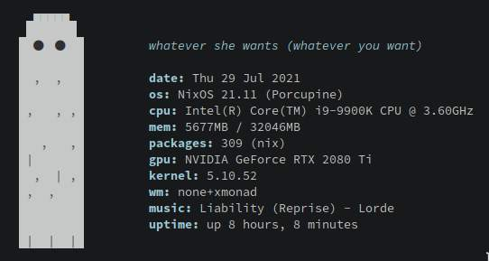
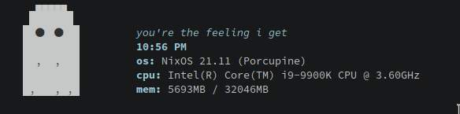
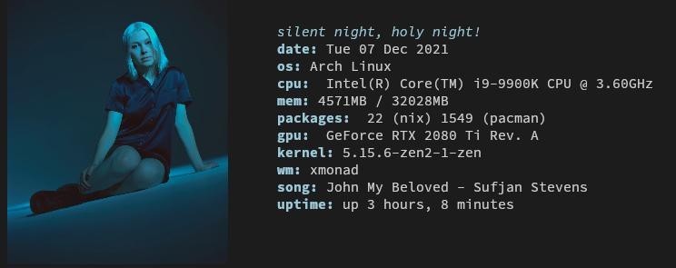

# My Dotfiles
[](https://builtwithnix.org)


### 🔨 My own work
* [fetch](fetch)



* [vim theme "pink ocean"](.config/nvim/colors/pink_ocean.vim)


| System name  |  System | Description |
|:------------:|:--------|:------|
| [Ivys-MacBook-Pro](#system-Ivys-MacBook-Pro-aarch64-darwin) |  aarch64-darwin | M4 Macbook Pro 2024 |
| [auspc](#system-auspc-x86_64-linux) |  x86_64-linux | Main Gaming desktop |
| [lora-pi](#system-lora-pi-aarch64-linux-rpi) |  aarch64-linux-rpi |  |
| [macmini](#system-macmini-aarch64-darwin) |  aarch64-darwin | &lt;nil&gt; |
| [pentestvm](#system-pentestvm-x86_64-linux) |  x86_64-linux | &lt;nil&gt; |
| [secondpc](#system-secondpc-x86_64-linux) |  x86_64-linux | Home server |
| [surfacelaptop](#system-surfacelaptop-x86_64-linux) |  x86_64-linux | &lt;nil&gt; |
| [wsl-nixos](#system-wsl-nixos-x86_64-linux) |  x86_64-linux | &lt;nil&gt; |

| Home | system | Description |
|:------------:|:--------|:---------|
| [auscyber@arch](#home-auscyber@arch-x86_64-linux) |  x86_64-linux | &lt;nil&gt; |
| [auscyber@auspc](#home-auscyber@auspc-x86_64-linux) |  x86_64-linux | &lt;nil&gt; |
| [auscyber@laptop](#home-auscyber@laptop-x86_64-linux) |  x86_64-linux | &lt;nil&gt; |
| [auscyber@secondpc](#home-auscyber@secondpc-x86_64-linux) |  x86_64-linux | &lt;nil&gt; |
| [ivy@fargonesh](#home-ivy@fargonesh-x86_64-linux) |  x86_64-linux | &lt;nil&gt; |
| [ivy@imflopet](#home-ivy@imflopet-x86_64-linux) |  x86_64-linux | &lt;nil&gt; |
| [ivy@lora-pi](#home-ivy@lora-pi-aarch64-linux-rpi) |  aarch64-linux-rpi | &lt;nil&gt; |
| [ivy@vmi1472413.contaboserver.net](#home-ivy@vmi1472413.contaboserver.net-x86_64-linux) |  x86_64-linux | &lt;nil&gt; |
| [ivypierlot@Ivys-MacBook-Pro](#home-ivypierlot@Ivys-MacBook-Pro-aarch64-darwin) |  aarch64-darwin | Home configuration for Ivys-MacBook-Pro |

## Homes
<h3 id="home-auscyber@arch-x86_64-linux">🏠 auscyber@arch </h3>

&lt;nil&gt;
* [config](/homes/x86_64-linux/auscyber@arch)

```
├── config
│    ├── flakeConfig
│    │    ├── flakeFolder : /home/auscyber/dotfiles
│    ├── meta

│    ├── nix  : enabled
│    ├── programs
│    │    ├── ssh  : enabled
│    ├── secrets  : enabled
│    ├── standalone  : enabled
├── secrets
│    ├── extra-nix-conf : extra-nix-conf
│    ├── github_token : github_token
```
<h3 id="home-auscyber@auspc-x86_64-linux">🏠 auscyber@auspc </h3>

&lt;nil&gt;
* [config](/homes/x86_64-linux/auscyber@auspc)

```
├── config
│    ├── browsers
│    │    ├── zen-browser  : enabled
│    ├── flakeConfig
│    │    ├── flakeFolder : /home/auscyber/dotfiles
│    ├── meta

│    ├── nix  : enabled
│    ├── programs
│    │    ├── _1password-cli  : enabled
│    │    ├── neovim  : enabled
│    │    ├── ssh  : enabled
│    │    ├── zotero  : enabled
│    ├── secrets  : enabled
│    ├── shell  : enabled
│    ├── standalone  : enabled
│    ├── terms
│    │    ├── ghostty  : enabled
├── secrets
│    ├── extra-nix-conf : extra-nix-conf
│    ├── github_token : github_token
│    ├── wakatime_config : wakatime_config
```
<h3 id="home-auscyber@laptop-x86_64-linux">🏠 auscyber@laptop </h3>

&lt;nil&gt;
* [config](/homes/x86_64-linux/auscyber@laptop)

```
├── config
│    ├── flakeConfig
│    │    ├── flakeFolder : /home/auscyber/dotfiles
│    ├── meta

│    ├── nix  : enabled
│    ├── programs
│    │    ├── ssh  : enabled
│    ├── secrets  : enabled
│    ├── standalone  : enabled
├── secrets
│    ├── extra-nix-conf : extra-nix-conf
│    ├── github_token : github_token
```
<h3 id="home-auscyber@secondpc-x86_64-linux">🏠 auscyber@secondpc </h3>

&lt;nil&gt;
* [config](/homes/x86_64-linux/auscyber@secondpc)

```
├── config
│    ├── flakeConfig
│    │    ├── flakeFolder : /home/auscyber/dotfiles
│    ├── meta

│    ├── nix  : enabled
│    ├── programs
│    │    ├── neovim  : enabled
│    │    ├── ssh  : enabled
│    ├── secrets  : enabled
│    ├── shell  : enabled
│    ├── standalone  : enabled
├── secrets
│    ├── extra-nix-conf : extra-nix-conf
│    ├── github_token : github_token
│    ├── wakatime_config : wakatime_config
```
<h3 id="home-ivy@fargonesh-x86_64-linux">🏠 ivy@fargonesh </h3>

&lt;nil&gt;
* [config](/homes/x86_64-linux/ivy@fargonesh)

```
├── config
│    ├── flakeConfig
│    │    ├── flakeFolder : /home/ivy/dotfiles
│    ├── meta

│    ├── nix  : enabled
│    ├── programs
│    │    ├── neovim  : enabled
│    │    ├── ssh  : enabled
│    ├── secrets  : enabled
│    ├── shell  : enabled
│    ├── standalone  : enabled
├── secrets
│    ├── extra-nix-conf : extra-nix-conf
│    ├── github_token : github_token
│    ├── wakatime_config : wakatime_config
```
<h3 id="home-ivy@imflopet-x86_64-linux">🏠 ivy@imflopet </h3>

&lt;nil&gt;
* [config](/homes/x86_64-linux/ivy@imflopet)

```
├── config
│    ├── flakeConfig
│    │    ├── flakeFolder : /home/ivy/dotfiles
│    ├── meta

│    ├── nix  : enabled
│    ├── programs
│    │    ├── neovim  : enabled
│    │    ├── ssh  : enabled
│    ├── secrets  : enabled
│    ├── shell  : enabled
│    ├── standalone  : enabled
├── secrets
│    ├── extra-nix-conf : extra-nix-conf
│    ├── github_token : github_token
│    ├── wakatime_config : wakatime_config
```
<h3 id="home-ivy@lora-pi-aarch64-linux-rpi">🏠 ivy@lora-pi </h3>

&lt;nil&gt;
* [config](/homes/aarch64-linux-rpi/ivy@lora-pi)

```
├── config
│    ├── flakeConfig
│    │    ├── flakeFolder : /home/ivy/dotfiles
│    ├── meta

│    ├── nix  : enabled
│    ├── programs
│    │    ├── ssh  : enabled
│    ├── secrets  : enabled
│    ├── shell  : enabled
│    ├── standalone  : enabled
├── secrets
│    ├── extra-nix-conf : extra-nix-conf
│    ├── github_token : github_token
```
<h3 id="home-ivy@vmi1472413.contaboserver.net-x86_64-linux">🏠 ivy@vmi1472413.contaboserver.net </h3>

&lt;nil&gt;
* [config](/homes/x86_64-linux/ivy@vmi1472413.contaboserver.net)

```
├── config
│    ├── flakeConfig
│    │    ├── flakeFolder : /home/ivy/dotfiles
│    ├── meta

│    ├── nix  : enabled
│    ├── programs
│    │    ├── neovim  : enabled
│    │    ├── ssh  : enabled
│    ├── secrets  : enabled
│    ├── shell  : enabled
│    ├── standalone  : enabled
├── secrets
│    ├── extra-nix-conf : extra-nix-conf
│    ├── github_token : github_token
│    ├── wakatime_config : wakatime_config
```
<h3 id="home-ivypierlot@Ivys-MacBook-Pro-aarch64-darwin">🏠 ivypierlot@Ivys-MacBook-Pro </h3>

Home configuration for Ivys-MacBook-Pro
* [config](/homes/aarch64-darwin/ivypierlot@Ivys-MacBook-Pro)

```
├── config
│    ├── browsers
│    │    ├── zen-browser  : enabled
│    ├── editors
│    │    ├── zed  : enabled
│    ├── flakeConfig
│    │    ├── flakeFolder : /Users/ivypierlot/dotfiles
│    ├── keybinds
│    │    ├── kanata  : enabled
│    ├── meta
│    │    ├── description : Home configuration for Ivys-MacBook-Pro
│    ├── nix  : enabled
│    ├── programs
│    │    ├── _1password-cli  : enabled
│    │    ├── neovim  : enabled
│    │    ├── sketchybar  : enabled
│    │    ├── ssh  : enabled
│    │    ├── zotero  : enabled
│    ├── secrets  : enabled
│    ├── shell  : enabled
│    ├── standalone  : enabled
│    ├── terms
│    │    ├── ghostty  : enabled
│    ├── wms
│    │    ├── yabai  : enabled
├── secrets
│    ├── extra-nix-conf : extra-nix-conf
│    ├── github_token : github_token
│    ├── wakatime_config : wakatime_config
```
## Systems
<h3 id="system-Ivys-MacBook-Pro-aarch64-darwin"> Ivys-MacBook-Pro </h3>
M4 Macbook Pro 2024

* [config](/systems/aarch64-darwin/Ivys-MacBook-Pro)

```
├── config
│    ├── hmApps  : enabled
│    ├── homebrew  : enabled
│    ├── keybinds
│    │    ├── karabiner-driver-kit  : enabled
│    ├── meta
│    │    ├── description : M4 Macbook Pro 2024
│    ├── nix  : enabled
│    ├── secrets  : enabled
│    ├── sudo
│    │    ├── agents  : enabled
│    │    ├── pam  : enabled
│    ├── user
│    │    ├── username : ivypierlot
├── secrets
│    ├── github_token : github_token
```
<h3 id="system-auspc-x86_64-linux"> auspc </h3>
Main Gaming desktop

* [config](/systems/x86_64-linux/auspc)

```
├── config
│    ├── bootlogo  : enabled
│    ├── meta
│    │    ├── description : Main Gaming desktop
│    ├── nix  : enabled
│    ├── nixos
│    │    ├── games  : enabled
│    ├── secrets  : enabled
│    ├── user
│    │    ├── username : auscyber
├── secrets
│    ├── github_token : github_token
│    ├── ivy-password : ivy-password
│    ├── ivy-pwd-hash : ivy-pwd-hash
```
<h3 id="system-lora-pi-aarch64-linux-rpi"> lora-pi </h3>


* [config](/systems/aarch64-linux-rpi/lora-pi)

```
├── config
│    ├── nix  : enabled
│    ├── secrets  : enabled
├── secrets
│    ├── github_token : github_token
│    ├── ivy-password : ivy-password
│    ├── ivy-pwd-hash : ivy-pwd-hash
```
<h3 id="system-macmini-aarch64-darwin"> macmini </h3>
&lt;nil&gt;

* [config](/systems/aarch64-darwin/macmini)

```
├── config
│    ├── hmApps  : enabled
│    ├── homebrew  : enabled
│    ├── meta

│    ├── nix  : enabled
│    ├── secrets  : enabled
│    ├── user
│    │    ├── username : ivypierlot
├── secrets
│    ├── github_token : github_token
```
<h3 id="system-pentestvm-x86_64-linux"> pentestvm </h3>
&lt;nil&gt;

* [config](/systems/x86_64-linux/pentestvm)

```
├── config
│    ├── meta

│    ├── nix  : enabled
│    ├── secrets  : enabled
│    ├── user
│    │    ├── username : auscyber
├── secrets
│    ├── github_token : github_token
│    ├── ivy-password : ivy-password
│    ├── ivy-pwd-hash : ivy-pwd-hash
```
<h3 id="system-secondpc-x86_64-linux"> secondpc </h3>
Home server

* [config](/systems/x86_64-linux/secondpc)

```
├── config
│    ├── meta
│    │    ├── description : Home server
│    ├── nix  : enabled
│    ├── secrets  : enabled
│    ├── user
│    │    ├── username : auscyber
├── secrets
│    ├── acme_cloudflare.env : acme_cloudflare.env
│    ├── github_token : github_token
│    ├── ivy-password : ivy-password
│    ├── ivy-pwd-hash : ivy-pwd-hash
│    ├── navidrome_env : navidrome_env
│    ├── slskd.env : slskd.env
│    ├── slskd_secrets_env : slskd_secrets_env
│    ├── soularr : soularr
│    ├── soularr_api_key : soularr_api_key
```
<h3 id="system-surfacelaptop-x86_64-linux"> surfacelaptop </h3>
&lt;nil&gt;

* [config](/systems/x86_64-linux/surfacelaptop)

```
├── config
│    ├── meta

│    ├── nix  : enabled
│    ├── secrets  : enabled
│    ├── user
│    │    ├── username : auscyber
├── secrets
│    ├── github_token : github_token
│    ├── ivy-password : ivy-password
│    ├── ivy-pwd-hash : ivy-pwd-hash
```
<h3 id="system-wsl-nixos-x86_64-linux"> wsl-nixos </h3>
&lt;nil&gt;

* [config](/systems/x86_64-linux/wsl-nixos)

```
├── config
│    ├── meta

│    ├── nix  : enabled
│    ├── secrets  : enabled
│    ├── user
│    │    ├── username : auscyber
├── secrets
│    ├── github_token : github_token
│    ├── ivy-password : ivy-password
│    ├── ivy-pwd-hash : ivy-pwd-hash
```


### 🤝 Other Projects
###### *(Non-extensive list*)

* [xmonad](https://github.com/xmonad/xmonad)
* [xmonad-contrib](https://github.com/xmonad/xmonad-contrib)
* [alacritty](https://github.com/alacritty/alacritty)
* [ghostty](https://github.com/ghostty-org/ghostty)
* [neovim](https://github.com/neovim/neovim)
* [Polybar](https://github.com/polybar/polybar)
* [rofi-themes](https://github.com/adi1090x/rofi)
* [starship](https://github.com/starship/starship)
* [*A large amount of vim/neovim plugins*](.config/nvim/fnl/plugins.fnl)
