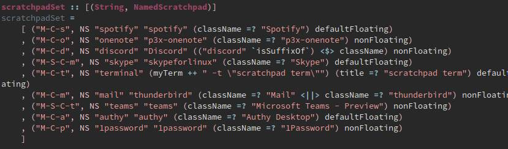
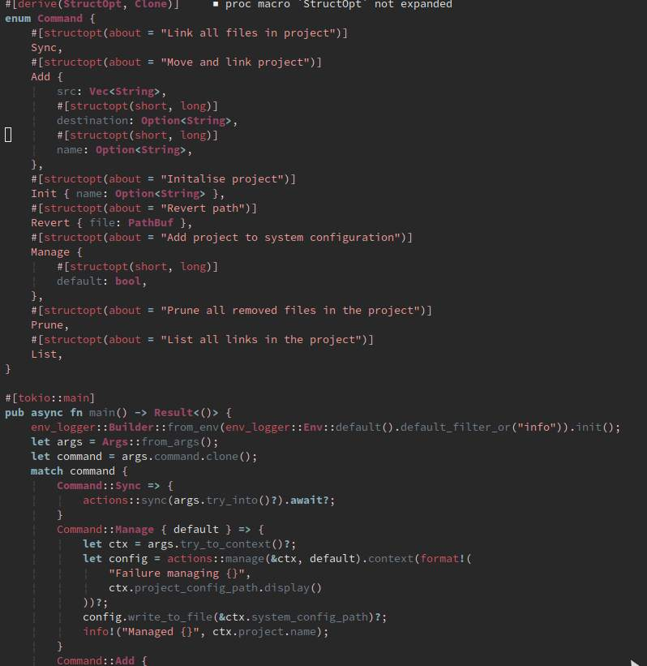
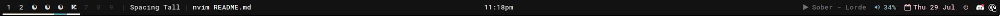

# Auscyber's Dotfiles

### Mine
* [dotfile sync](https://github.com/auscyberman/dotfile-sync) is a program i wrote to manage dotfiles, my configuration is [here](.links.toml)
* [fetch](fetch)
    

* [vim theme "pink ocean"](.config/nvim/colors/pink_ocean.vim)  
  

* [Polybar Theme](.config/polybar/config.ini)  

* [extensive xmonad configuratio](xmonad)

### Not mine
###### *(Non-extensive list*)

* [xmonad](https://github.com/xmonad/xmonad)
* [xmonad-contrib](https://github.com/xmonad/xmonad-contrib) *Which I have contributed to*
* [alacritty](https://github.com/alacritty/alacritty)
* [neovim](https://github.com/neovim/neovim) 
* [Polybar](https://github.com/polybar/polybar)
* [rofi-themes](https://github.com/adi1090x/rofi)
* [*A large amount of vim/neovim plugins*](.config/nvim/fnl/plugins.fnl)
