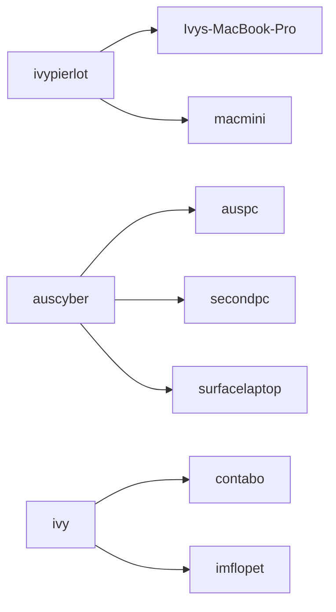

# My Dotfiles

## Systems

| System | Architecture | Roles |
|--------|--------------|-------|
| Ivys-MacBook-Pro | aarch64-darwin | study, gui, dev |
| auspc | x86_64-linux | gui, gaming, dev |
| contabo | x86_64-linux |  |
| imflopet | x86_64-linux |  |
| macmini | aarch64-darwin | gui |
| pentestvm | x86_64-linux |  |
| secondpc | x86_64-linux |  |
| surfacelaptop | x86_64-linux | gui, dev |
| wsl-nixos | x86_64-linux |  |

## Aspect Graph

```mermaid
graph LR
  ivypierlot --> Ivys-MacBook-Pro
  auscyber --> auspc
  ivy --> contabo
  ivy --> imflopet
  ivypierlot --> macmini
  auscyber --> secondpc
  auscyber --> surfacelaptop
```

### Ivys-MacBook-Pro

**Architecture:** aarch64-darwin
**Roles:** study, gui, dev

**Aspects:**
- ivypierlot

### auspc

**Architecture:** x86_64-linux
**Roles:** gui, gaming, dev

**Aspects:**
- auscyber

### contabo

**Architecture:** x86_64-linux

**Aspects:**
- ivy

### imflopet

**Architecture:** x86_64-linux

**Aspects:**
- ivy

### macmini

**Architecture:** aarch64-darwin
**Roles:** gui

**Aspects:**
- ivypierlot

### pentestvm

**Architecture:** x86_64-linux

**Aspects:**
_No aspects directly provide to this host_

### secondpc

**Architecture:** x86_64-linux

**Aspects:**
- auscyber

### surfacelaptop

**Architecture:** x86_64-linux
**Roles:** gui, dev

**Aspects:**
- auscyber

### wsl-nixos

**Architecture:** x86_64-linux

**Aspects:**
_No aspects directly provide to this host_

## Other Projects
- [xmonad](https://github.com/xmonad/xmonad)
- [xmonad-contrib](https://github.com/xmonad/xmonad-contrib)
- [alacritty](https://github.com/alacritty/alacritty)
- [ghostty](https://github.com/ghostty-org/ghostty)
- [neovim](https://github.com/neovim/neovim)
- [starship](https://github.com/starship/starship)
