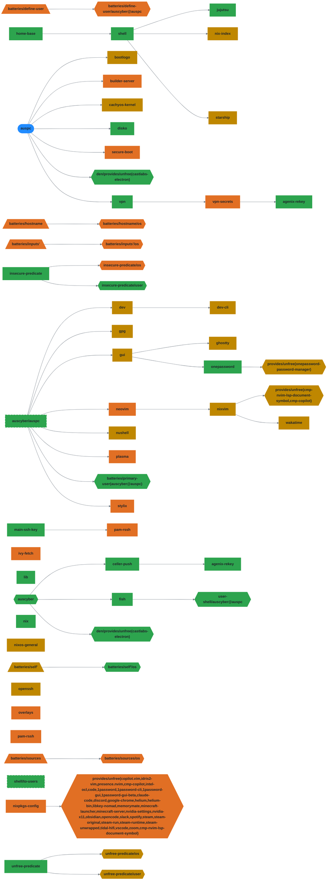
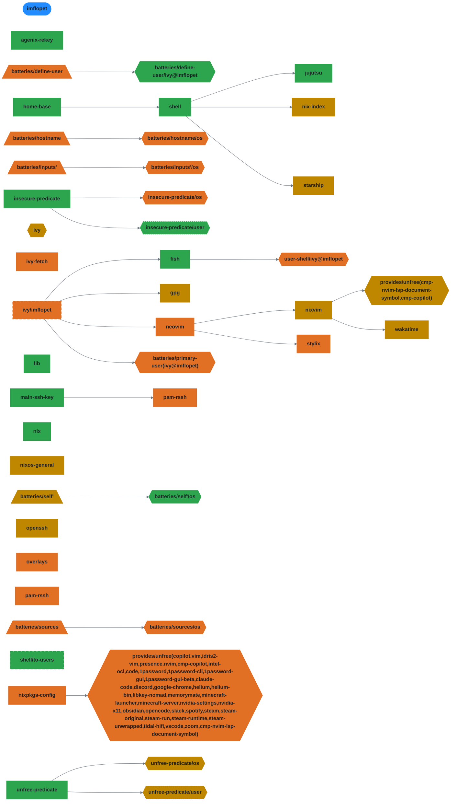
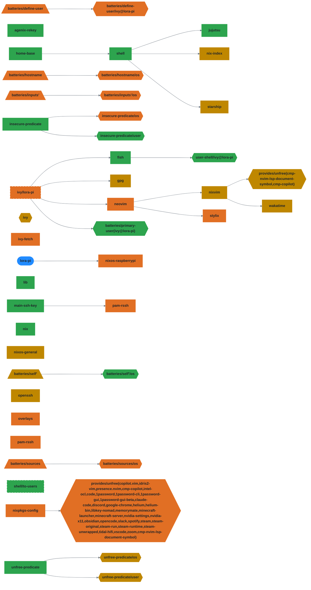
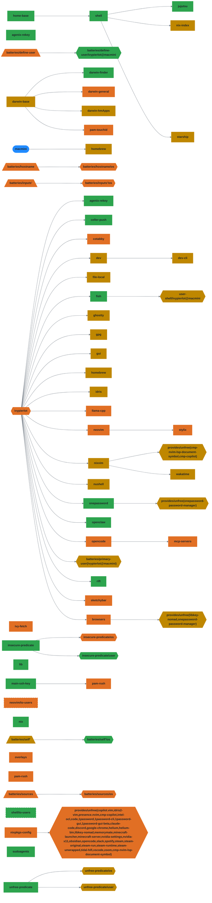
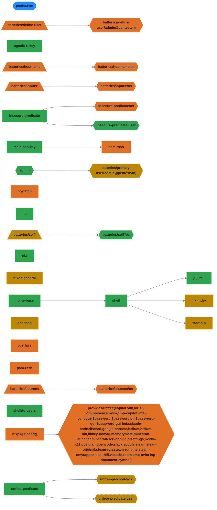
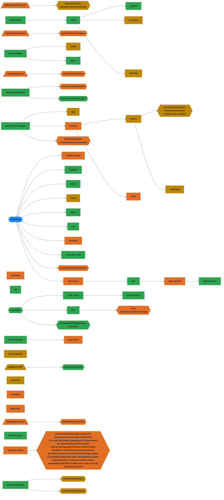
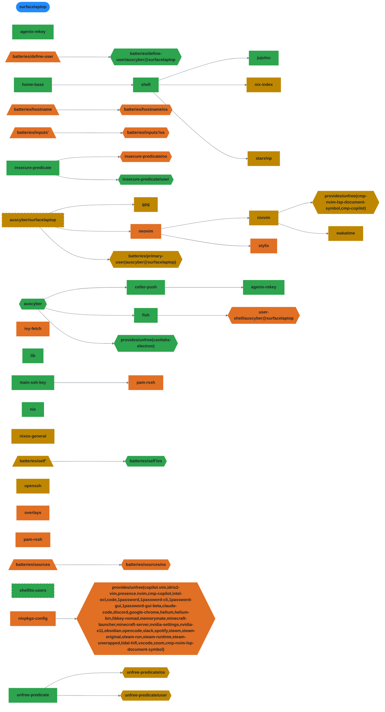
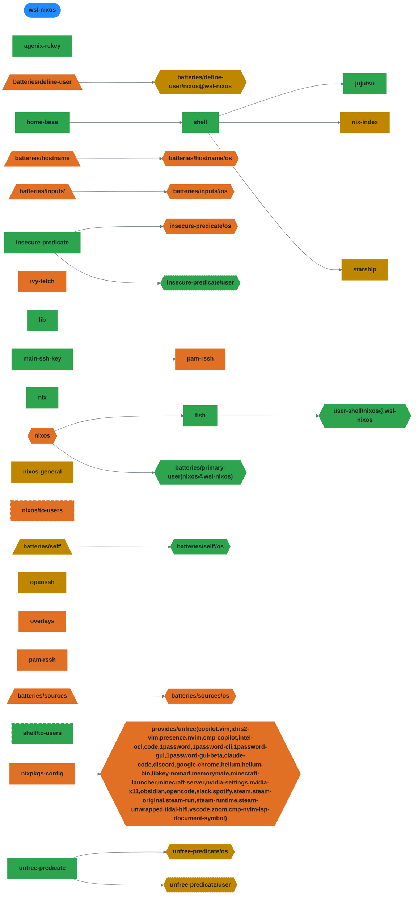

# My Dotfiles
[](https://builtwithnix.org)

## Systems

| System | Architecture | Roles |
|--------|--------------|-------|
| Ivys-MacBook-Pro | aarch64-darwin | study, gui, dev |
| auspc | x86_64-linux | gui, gaming, dev |
| imflopet | x86_64-linux |  |
| lora-pi | aarch64-linux |  |
| macmini | aarch64-darwin | gui |
| pentestvm | x86_64-linux |  |
| secondpc | x86_64-linux |  |
| surfacelaptop | x86_64-linux | gui, dev |
| wsl-nixos | x86_64-linux |  |

## Ivys-MacBook-Pro

**Architecture:** `aarch64-darwin`
**Roles:** study, gui, dev

### Aspect Graph

```mermaid
%%{init: {"theme":"base","themeVariables":{"activationBkgColor":"#d0d7de","activationBorderColor":"#8c959f","actorBkg":"#d0d7de","actorBorder":"#6e7781","actorLineColor":"#6e7781","actorTextColor":"#424a53","background":"#eaeef2","classText":"#424a53","clusterBkg":"#d0d7de","clusterBorder":"#8c959f","edgeLabelBackground":"#eaeef2","labelBoxBkgColor":"#d0d7de","labelBoxBorderColor":"#6e7781","labelTextColor":"#424a53","lineColor":"#6e7781","loopTextColor":"#424a53","mainBkg":"#d0d7de","nodeBkg":"#d0d7de","nodeBorder":"#6e7781","nodeTextColor":"#424a53","noteBkgColor":"#d0d7de","noteBorderColor":"#8c959f","noteTextColor":"#424a53","pie1":"#fa4549","pie2":"#e16f24","pie3":"#bf8700","pie4":"#2da44e","pie5":"#339D9B","pie6":"#218bff","pie7":"#a475f9","pie8":"#4d2d00","pieLegendTextColor":"#424a53","pieOuterStrokeColor":"#8c959f","pieSectionTextColor":"#424a53","pieStrokeColor":"#8c959f","pieTitleTextColor":"#424a53","primaryBorderColor":"#6e7781","primaryColor":"#d0d7de","primaryTextColor":"#424a53","secondBkg":"#d0d7de","secondaryBorderColor":"#8c959f","secondaryColor":"#d0d7de","secondaryTextColor":"#424a53","sequenceNumberColor":"#eaeef2","signalColor":"#6e7781","signalTextColor":"#424a53","tertiaryBorderColor":"#8c959f","tertiaryColor":"#d0d7de","tertiaryTextColor":"#424a53","textColor":"#424a53","titleColor":"#424a53"}}}%%
graph LR
  Ivys_MacBook_Pro([Ivys-MacBook-Pro]):::root
  agenix_rekey_host_Ivys_MacBook_Pro["agenix-rekey"]:::agenix_rekey_host_Ivys_MacBook_Pro_c
  agenix_rekey_user_ivypierlot["agenix-rekey"]:::agenix_rekey_user_ivypierlot_c
  browsers["browsers"]:::browsers_c
  celler_push["celler-push"]:::celler_push_c
  cotabby["cotabby"]:::cotabby_c
  darwin_base["darwin-base"]:::darwin_base_c
  darwin_finder["darwin-finder"]:::darwin_finder_c
  darwin_general["darwin-general"]:::darwin_general_c
  darwin_hmApps["darwin-hmApps"]:::darwin_hmApps_c
  den__batteries__define_user[/"batteries/define-user"\]:::den__batteries__define_user_c
  den__batteries__define_user__ivypierlot_Ivys_MacBook_Pro{{"batteries/define-user/ivypierlot@Ivys-MacBook-Pro"}}:::den__batteries__define_user__ivypierlot_Ivys_MacBook_Pro_c
  dev["dev"]:::dev_c
  dev_cli["dev-cli"]:::dev_cli_c
  file_local["file-local"]:::file_local_c
  fish["fish"]:::fish_c
  ghostty["ghostty"]:::ghostty_c
  gpg["gpg"]:::gpg_c
  gui["gui"]:::gui_c
  home_base["home-base"]:::home_base_c
  homebrew_host_Ivys_MacBook_Pro["homebrew"]:::homebrew_host_Ivys_MacBook_Pro_c
  homebrew_user_ivypierlot["homebrew"]:::homebrew_user_ivypierlot_c
  den__batteries__hostname[/"batteries/hostname"\]:::den__batteries__hostname_c
  den__batteries__hostname__os{{"batteries/hostname/os"}}:::den__batteries__hostname__os_c
  idris["idris"]:::idris_c
  den__batteries__inputs_[/"batteries/inputs'"\]:::den__batteries__inputs__c
  den__batteries__inputs___os{{"batteries/inputs'/os"}}:::den__batteries__inputs___os_c
  insecure_predicate["insecure-predicate"]:::insecure_predicate_c
  insecure_predicate__os{{"insecure-predicate/os"}}:::insecure_predicate__os_c
  insecure_predicate__user{{"insecure-predicate/user"}}:::insecure_predicate__user_c
  ivy_fetch["ivy-fetch"]:::ivy_fetch_c
  ivypierlot{{"ivypierlot"}}:::ivypierlot_c
  jujutsu["jujutsu"]:::jujutsu_c
  karabiner_driver["karabiner-driver"]:::karabiner_driver_c
  lib["lib"]:::lib_c
  llama_cpp["llama-cpp"]:::llama_cpp_c
  main_ssh_key["main-ssh-key"]:::main_ssh_key_c
  mcp_servers["mcp-servers"]:::mcp_servers_c
  neovim["neovim"]:::neovim_c
  neovim__to_users["neovim/to-users"]:::neovim__to_users_c
  nix["nix"]:::nix_c
  nix_index["nix-index"]:::nix_index_c
  nixpkgs_config_host_Ivys_MacBook_Pro["nixpkgs-config"]:::nixpkgs_config_host_Ivys_MacBook_Pro_c
  nixvim["nixvim"]:::nixvim_c
  nushell["nushell"]:::nushell_c
  onepassword["onepassword"]:::onepassword_c
  openclaw["openclaw"]:::openclaw_c
  opencode["opencode"]:::opencode_c
  overlays["overlays"]:::overlays_c
  pam_rssh_host_Ivys_MacBook_Pro["pam-rssh"]:::pam_rssh_host_Ivys_MacBook_Pro_c
  pam_rssh_user_ivypierlot["pam-rssh"]:::pam_rssh_user_ivypierlot_c
  pam_touchid["pam-touchid"]:::pam_touchid_c
  den__batteries__primary_user_ivypierlot_Ivys_MacBook_Pro_{{"batteries/primary-user(ivypierlot@Ivys-MacBook-Pro)"}}:::den__batteries__primary_user_ivypierlot_Ivys_MacBook_Pro__c
  rift["rift"]:::rift_c
  den__batteries__self_[/"batteries/self'"\]:::den__batteries__self__c
  den__batteries__self___os{{"batteries/self'/os"}}:::den__batteries__self___os_c
  shell_host_Ivys_MacBook_Pro["shell"]:::shell_host_Ivys_MacBook_Pro_c
  shell__to_users["shell/to-users"]:::shell__to_users_c
  sketchybar["sketchybar"]:::sketchybar_c
  den__batteries__sources[/"batteries/sources"\]:::den__batteries__sources_c
  den__batteries__sources__os{{"batteries/sources/os"}}:::den__batteries__sources__os_c
  starship["starship"]:::starship_c
  stylix["stylix"]:::stylix_c
  sudoagents_host_Ivys_MacBook_Pro["sudoagents"]:::sudoagents_host_Ivys_MacBook_Pro_c
  sudoagents_user_ivypierlot["sudoagents"]:::sudoagents_user_ivypierlot_c
  den__provides__unfree_cmp_nvim_lsp_document_symbol_cmp_copilot_{{"provides/unfree(cmp-nvim-lsp-document-symbol,cmp-copilot)"}}:::den__provides__unfree_cmp_nvim_lsp_document_symbol_cmp_copilot__c
  den__provides__unfree_copilot_vim_idris2_vim_presence_nvim_cmp_copilot_intel_ocl_code_1password_1password_cli_1password_gui_1password_gui_beta_claude_code_discord_google_chrome_helium_helium_bin_libkey_nomad_memorymate_minecraft_launcher_minecraft_server_nvidia_settings_nvidia_x11_obsidian_opencode_slack_spotify_steam_steam_original_steam_run_steam_runtime_steam_unwrapped_tidal_hifi_vscode_zoom_cmp_nvim_lsp_document_symbol_{{"provides/unfree(copilot.vim,idris2-vim,presence.nvim,cmp-copilot,intel-ocl,code,1password,1password-cli,1password-gui,1password-gui-beta,claude-code,discord,google-chrome,helium,helium-bin,libkey-nomad,memorymate,minecraft-launcher,minecraft-server,nvidia-settings,nvidia-x11,obsidian,opencode,slack,spotify,steam,steam-original,steam-run,steam-runtime,steam-unwrapped,tidal-hifi,vscode,zoom,cmp-nvim-lsp-document-symbol)"}}:::den__provides__unfree_copilot_vim_idris2_vim_presence_nvim_cmp_copilot_intel_ocl_code_1password_1password_cli_1password_gui_1password_gui_beta_claude_code_discord_google_chrome_helium_helium_bin_libkey_nomad_memorymate_minecraft_launcher_minecraft_server_nvidia_settings_nvidia_x11_obsidian_opencode_slack_spotify_steam_steam_original_steam_run_steam_runtime_steam_unwrapped_tidal_hifi_vscode_zoom_cmp_nvim_lsp_document_symbol__c
  den__provides__unfree_libkey_nomad_onepassword_password_manager_{{"provides/unfree(libkey-nomad,onepassword-password-manager)"}}:::den__provides__unfree_libkey_nomad_onepassword_password_manager__c
  den__provides__unfree_onepassword_password_manager_{{"provides/unfree(onepassword-password-manager)"}}:::den__provides__unfree_onepassword_password_manager__c
  unfree_predicate["unfree-predicate"]:::unfree_predicate_c
  unfree_predicate__os{{"unfree-predicate/os"}}:::unfree_predicate__os_c
  unfree_predicate__user{{"unfree-predicate/user"}}:::unfree_predicate__user_c
  user_shell__ivypierlot_Ivys_MacBook_Pro{{"user-shell/ivypierlot@Ivys-MacBook-Pro"}}:::user_shell__ivypierlot_Ivys_MacBook_Pro_c
  vpn["vpn"]:::vpn_c
  vpn_secrets["vpn-secrets"]:::vpn_secrets_c
  wakatime["wakatime"]:::wakatime_c
  zotero["zotero"]:::zotero_c

  Ivys_MacBook_Pro --> homebrew_host_Ivys_MacBook_Pro
  Ivys_MacBook_Pro --> karabiner_driver
  Ivys_MacBook_Pro --> sudoagents_host_Ivys_MacBook_Pro
  Ivys_MacBook_Pro --> vpn
  browsers --> den__provides__unfree_libkey_nomad_onepassword_password_manager_
  darwin_base --> darwin_finder
  darwin_base --> darwin_general
  darwin_base --> darwin_hmApps
  darwin_base --> pam_touchid
  den__batteries__define_user --> den__batteries__define_user__ivypierlot_Ivys_MacBook_Pro
  den__batteries__hostname --> den__batteries__hostname__os
  den__batteries__inputs_ --> den__batteries__inputs___os
  den__batteries__self_ --> den__batteries__self___os
  den__batteries__sources --> den__batteries__sources__os
  dev --> dev_cli
  fish --> user_shell__ivypierlot_Ivys_MacBook_Pro
  home_base --> shell_host_Ivys_MacBook_Pro
  insecure_predicate --> insecure_predicate__os
  insecure_predicate --> insecure_predicate__user
  ivypierlot --> agenix_rekey_user_ivypierlot
  ivypierlot --> celler_push
  ivypierlot --> cotabby
  ivypierlot --> dev
  ivypierlot --> file_local
  ivypierlot --> fish
  ivypierlot --> ghostty
  ivypierlot --> gpg
  ivypierlot --> gui
  ivypierlot --> homebrew_user_ivypierlot
  ivypierlot --> idris
  ivypierlot --> llama_cpp
  ivypierlot --> neovim
  ivypierlot --> nixvim
  ivypierlot --> nushell
  ivypierlot --> onepassword
  ivypierlot --> openclaw
  ivypierlot --> opencode
  ivypierlot --> den__batteries__primary_user_ivypierlot_Ivys_MacBook_Pro_
  ivypierlot --> rift
  ivypierlot --> sketchybar
  ivypierlot --> browsers
  main_ssh_key --> pam_rssh_user_ivypierlot
  neovim --> stylix
  nixpkgs_config_host_Ivys_MacBook_Pro --> den__provides__unfree_copilot_vim_idris2_vim_presence_nvim_cmp_copilot_intel_ocl_code_1password_1password_cli_1password_gui_1password_gui_beta_claude_code_discord_google_chrome_helium_helium_bin_libkey_nomad_memorymate_minecraft_launcher_minecraft_server_nvidia_settings_nvidia_x11_obsidian_opencode_slack_spotify_steam_steam_original_steam_run_steam_runtime_steam_unwrapped_tidal_hifi_vscode_zoom_cmp_nvim_lsp_document_symbol_
  nixvim --> den__provides__unfree_cmp_nvim_lsp_document_symbol_cmp_copilot_
  nixvim --> wakatime
  onepassword --> den__provides__unfree_onepassword_password_manager_
  opencode --> mcp_servers
  shell_host_Ivys_MacBook_Pro --> jujutsu
  shell_host_Ivys_MacBook_Pro --> nix_index
  shell_host_Ivys_MacBook_Pro --> starship
  unfree_predicate --> unfree_predicate__os
  unfree_predicate --> unfree_predicate__user
  vpn --> vpn_secrets
  vpn_secrets --> agenix_rekey_host_Ivys_MacBook_Pro

  classDef root fill:#218bff,stroke:#218bff,color:#1f2328,font-weight:bold
  classDef Ivys_MacBook_Pro_c fill:#e16f24,stroke:#e16f24,color:#1f2328,stroke-width:3px
  classDef agenix_rekey_host_Ivys_MacBook_Pro_c fill:#2da44e,stroke:#2da44e,color:#1f2328,stroke-width:3px
  classDef agenix_rekey_user_ivypierlot_c fill:#2da44e,stroke:#2da44e,color:#1f2328,stroke-width:3px
  classDef browsers_c fill:#e16f24,stroke:#e16f24,color:#1f2328,stroke-dasharray: 3 3,stroke-width:1px
  classDef celler_push_c fill:#2da44e,stroke:#2da44e,color:#1f2328,stroke-width:3px
  classDef cotabby_c fill:#e16f24,stroke:#e16f24,color:#1f2328,stroke-width:3px
  classDef darwin_base_c fill:#bf8700,stroke:#bf8700,color:#1f2328,stroke-width:3px
  classDef darwin_finder_c fill:#2da44e,stroke:#2da44e,color:#1f2328,stroke-width:3px
  classDef darwin_general_c fill:#e16f24,stroke:#e16f24,color:#1f2328,stroke-width:3px
  classDef darwin_hmApps_c fill:#bf8700,stroke:#bf8700,color:#1f2328,stroke-width:3px
  classDef den__batteries__define_user_c fill:#e16f24,stroke:#e16f24,color:#1f2328,stroke-width:3px
  classDef den__batteries__define_user__ivypierlot_Ivys_MacBook_Pro_c fill:#2da44e,stroke:#2da44e,color:#1f2328,stroke-width:2px
  classDef dev_c fill:#bf8700,stroke:#bf8700,color:#1f2328,stroke-width:3px
  classDef dev_cli_c fill:#bf8700,stroke:#bf8700,color:#1f2328,stroke-width:3px
  classDef file_local_c fill:#bf8700,stroke:#bf8700,color:#1f2328,stroke-width:3px
  classDef fish_c fill:#2da44e,stroke:#2da44e,color:#1f2328,stroke-width:3px
  classDef ghostty_c fill:#bf8700,stroke:#bf8700,color:#1f2328,stroke-width:3px
  classDef gpg_c fill:#bf8700,stroke:#bf8700,color:#1f2328,stroke-width:3px
  classDef gui_c fill:#bf8700,stroke:#bf8700,color:#1f2328,stroke-width:3px
  classDef home_base_c fill:#2da44e,stroke:#2da44e,color:#1f2328,stroke-width:3px
  classDef homebrew_host_Ivys_MacBook_Pro_c fill:#bf8700,stroke:#bf8700,color:#1f2328,stroke-width:3px
  classDef homebrew_user_ivypierlot_c fill:#bf8700,stroke:#bf8700,color:#1f2328,stroke-width:3px
  classDef den__batteries__hostname_c fill:#e16f24,stroke:#e16f24,color:#1f2328,stroke-width:3px
  classDef den__batteries__hostname__os_c fill:#e16f24,stroke:#e16f24,color:#1f2328,stroke-width:2px
  classDef idris_c fill:#bf8700,stroke:#bf8700,color:#1f2328,stroke-width:3px
  classDef den__batteries__inputs__c fill:#e16f24,stroke:#e16f24,color:#1f2328,stroke-width:3px
  classDef den__batteries__inputs___os_c fill:#e16f24,stroke:#e16f24,color:#1f2328,stroke-width:2px
  classDef insecure_predicate_c fill:#2da44e,stroke:#2da44e,color:#1f2328,stroke-width:3px
  classDef insecure_predicate__os_c fill:#e16f24,stroke:#e16f24,color:#1f2328,stroke-width:2px
  classDef insecure_predicate__user_c fill:#2da44e,stroke:#2da44e,color:#1f2328,stroke-dasharray: 3 3,stroke-width:1px
  classDef ivy_fetch_c fill:#e16f24,stroke:#e16f24,color:#1f2328,stroke-width:3px
  classDef ivypierlot_c fill:#e16f24,stroke:#e16f24,color:#1f2328,stroke-width:3px
  classDef jujutsu_c fill:#2da44e,stroke:#2da44e,color:#1f2328,stroke-width:3px
  classDef karabiner_driver_c fill:#bf8700,stroke:#bf8700,color:#1f2328,stroke-width:3px
  classDef lib_c fill:#2da44e,stroke:#2da44e,color:#1f2328,stroke-width:3px
  classDef llama_cpp_c fill:#e16f24,stroke:#e16f24,color:#1f2328,stroke-width:3px
  classDef main_ssh_key_c fill:#2da44e,stroke:#2da44e,color:#1f2328,stroke-width:3px
  classDef mcp_servers_c fill:#e16f24,stroke:#e16f24,color:#1f2328,stroke-width:3px
  classDef neovim_c fill:#e16f24,stroke:#e16f24,color:#1f2328,stroke-width:3px
  classDef neovim__to_users_c fill:#e16f24,stroke:#e16f24,color:#1f2328,stroke-width:2px,stroke-dasharray: 8 4
  classDef nix_c fill:#2da44e,stroke:#2da44e,color:#1f2328,stroke-width:3px
  classDef nix_index_c fill:#bf8700,stroke:#bf8700,color:#1f2328,stroke-width:3px
  classDef nixpkgs_config_host_Ivys_MacBook_Pro_c fill:#e16f24,stroke:#e16f24,color:#1f2328,stroke-width:3px
  classDef nixvim_c fill:#bf8700,stroke:#bf8700,color:#1f2328,stroke-width:3px
  classDef nushell_c fill:#bf8700,stroke:#bf8700,color:#1f2328,stroke-width:3px
  classDef onepassword_c fill:#2da44e,stroke:#2da44e,color:#1f2328,stroke-width:3px
  classDef openclaw_c fill:#2da44e,stroke:#2da44e,color:#1f2328,stroke-width:3px
  classDef opencode_c fill:#e16f24,stroke:#e16f24,color:#1f2328,stroke-width:3px
  classDef overlays_c fill:#e16f24,stroke:#e16f24,color:#1f2328,stroke-width:3px
  classDef pam_rssh_host_Ivys_MacBook_Pro_c fill:#e16f24,stroke:#e16f24,color:#1f2328,stroke-width:3px
  classDef pam_rssh_user_ivypierlot_c fill:#e16f24,stroke:#e16f24,color:#1f2328,stroke-width:3px
  classDef pam_touchid_c fill:#e16f24,stroke:#e16f24,color:#1f2328,stroke-width:3px
  classDef den__batteries__primary_user_ivypierlot_Ivys_MacBook_Pro__c fill:#bf8700,stroke:#bf8700,color:#1f2328,stroke-width:2px
  classDef rift_c fill:#2da44e,stroke:#2da44e,color:#1f2328,stroke-width:3px
  classDef den__batteries__self__c fill:#bf8700,stroke:#bf8700,color:#1f2328,stroke-width:3px
  classDef den__batteries__self___os_c fill:#2da44e,stroke:#2da44e,color:#1f2328,stroke-width:2px
  classDef shell_host_Ivys_MacBook_Pro_c fill:#2da44e,stroke:#2da44e,color:#1f2328,stroke-width:3px
  classDef shell__to_users_c fill:#2da44e,stroke:#2da44e,color:#1f2328,stroke-width:2px,stroke-dasharray: 8 4
  classDef sketchybar_c fill:#e16f24,stroke:#e16f24,color:#1f2328,stroke-width:3px
  classDef den__batteries__sources_c fill:#e16f24,stroke:#e16f24,color:#1f2328,stroke-width:3px
  classDef den__batteries__sources__os_c fill:#e16f24,stroke:#e16f24,color:#1f2328,stroke-width:2px
  classDef starship_c fill:#bf8700,stroke:#bf8700,color:#1f2328,stroke-width:3px
  classDef stylix_c fill:#e16f24,stroke:#e16f24,color:#1f2328,stroke-width:3px
  classDef sudoagents_host_Ivys_MacBook_Pro_c fill:#2da44e,stroke:#2da44e,color:#1f2328,stroke-width:3px
  classDef sudoagents_user_ivypierlot_c fill:#2da44e,stroke:#2da44e,color:#1f2328,stroke-width:3px
  classDef den__provides__unfree_cmp_nvim_lsp_document_symbol_cmp_copilot__c fill:#bf8700,stroke:#bf8700,color:#1f2328,stroke-width:2px
  classDef den__provides__unfree_copilot_vim_idris2_vim_presence_nvim_cmp_copilot_intel_ocl_code_1password_1password_cli_1password_gui_1password_gui_beta_claude_code_discord_google_chrome_helium_helium_bin_libkey_nomad_memorymate_minecraft_launcher_minecraft_server_nvidia_settings_nvidia_x11_obsidian_opencode_slack_spotify_steam_steam_original_steam_run_steam_runtime_steam_unwrapped_tidal_hifi_vscode_zoom_cmp_nvim_lsp_document_symbol__c fill:#e16f24,stroke:#e16f24,color:#1f2328,stroke-width:2px
  classDef den__provides__unfree_libkey_nomad_onepassword_password_manager__c fill:#bf8700,stroke:#bf8700,color:#1f2328,stroke-width:2px
  classDef den__provides__unfree_onepassword_password_manager__c fill:#bf8700,stroke:#bf8700,color:#1f2328,stroke-width:2px
  classDef unfree_predicate_c fill:#2da44e,stroke:#2da44e,color:#1f2328,stroke-width:3px
  classDef unfree_predicate__os_c fill:#bf8700,stroke:#bf8700,color:#1f2328,stroke-width:2px
  classDef unfree_predicate__user_c fill:#bf8700,stroke:#bf8700,color:#1f2328,stroke-dasharray: 3 3,stroke-width:1px
  classDef user_shell__ivypierlot_Ivys_MacBook_Pro_c fill:#bf8700,stroke:#bf8700,color:#1f2328,stroke-width:2px
  classDef vpn_c fill:#2da44e,stroke:#2da44e,color:#1f2328,stroke-width:3px
  classDef vpn_secrets_c fill:#e16f24,stroke:#e16f24,color:#1f2328,stroke-width:3px
  classDef wakatime_c fill:#bf8700,stroke:#bf8700,color:#1f2328,stroke-width:3px
  classDef zotero_c fill:#2da44e,stroke:#2da44e,color:#1f2328,stroke-width:3px
```

## auspc

**Architecture:** `x86_64-linux`
**Roles:** gui, gaming, dev

### Aspect Graph


```mermaid
%%{init: {"theme":"base","themeVariables":{"activationBkgColor":"#d0d7de","activationBorderColor":"#8c959f","actorBkg":"#d0d7de","actorBorder":"#6e7781","actorLineColor":"#6e7781","actorTextColor":"#424a53","background":"#eaeef2","classText":"#424a53","clusterBkg":"#d0d7de","clusterBorder":"#8c959f","edgeLabelBackground":"#eaeef2","labelBoxBkgColor":"#d0d7de","labelBoxBorderColor":"#6e7781","labelTextColor":"#424a53","lineColor":"#6e7781","loopTextColor":"#424a53","mainBkg":"#d0d7de","nodeBkg":"#d0d7de","nodeBorder":"#6e7781","nodeTextColor":"#424a53","noteBkgColor":"#d0d7de","noteBorderColor":"#8c959f","noteTextColor":"#424a53","pie1":"#fa4549","pie2":"#e16f24","pie3":"#bf8700","pie4":"#2da44e","pie5":"#339D9B","pie6":"#218bff","pie7":"#a475f9","pie8":"#4d2d00","pieLegendTextColor":"#424a53","pieOuterStrokeColor":"#8c959f","pieSectionTextColor":"#424a53","pieStrokeColor":"#8c959f","pieTitleTextColor":"#424a53","primaryBorderColor":"#6e7781","primaryColor":"#d0d7de","primaryTextColor":"#424a53","secondBkg":"#d0d7de","secondaryBorderColor":"#8c959f","secondaryColor":"#d0d7de","secondaryTextColor":"#424a53","sequenceNumberColor":"#eaeef2","signalColor":"#6e7781","signalTextColor":"#424a53","tertiaryBorderColor":"#8c959f","tertiaryColor":"#d0d7de","tertiaryTextColor":"#424a53","textColor":"#424a53","titleColor":"#424a53"}}}%%
graph LR
  auspc([auspc]):::root
  agenix_rekey_host_auspc["agenix-rekey"]:::agenix_rekey_host_auspc_c
  agenix_rekey_user_auscyber["agenix-rekey"]:::agenix_rekey_user_auscyber_c
  auscyber{{"auscyber"}}:::auscyber_c
  auscyber__auspc["auscyber/auspc"]:::auscyber__auspc_c
  bootlogo["bootlogo"]:::bootlogo_c
  builder_server["builder-server"]:::builder_server_c
  cachyos_kernel["cachyos-kernel"]:::cachyos_kernel_c
  celler_push["celler-push"]:::celler_push_c
  den__batteries__define_user[/"batteries/define-user"\]:::den__batteries__define_user_c
  den__batteries__define_user__auscyber_auspc{{"batteries/define-user/auscyber@auspc"}}:::den__batteries__define_user__auscyber_auspc_c
  dev["dev"]:::dev_c
  dev_cli["dev-cli"]:::dev_cli_c
  disko["disko"]:::disko_c
  fish["fish"]:::fish_c
  ghostty["ghostty"]:::ghostty_c
  gpg["gpg"]:::gpg_c
  gui["gui"]:::gui_c
  home_base["home-base"]:::home_base_c
  den__batteries__hostname[/"batteries/hostname"\]:::den__batteries__hostname_c
  den__batteries__hostname__os{{"batteries/hostname/os"}}:::den__batteries__hostname__os_c
  den__batteries__inputs_[/"batteries/inputs'"\]:::den__batteries__inputs__c
  den__batteries__inputs___os{{"batteries/inputs'/os"}}:::den__batteries__inputs___os_c
  insecure_predicate["insecure-predicate"]:::insecure_predicate_c
  insecure_predicate__os{{"insecure-predicate/os"}}:::insecure_predicate__os_c
  insecure_predicate__user{{"insecure-predicate/user"}}:::insecure_predicate__user_c
  ivy_fetch["ivy-fetch"]:::ivy_fetch_c
  jujutsu["jujutsu"]:::jujutsu_c
  lib["lib"]:::lib_c
  main_ssh_key["main-ssh-key"]:::main_ssh_key_c
  neovim["neovim"]:::neovim_c
  nix["nix"]:::nix_c
  nix_index["nix-index"]:::nix_index_c
  nixos_general["nixos-general"]:::nixos_general_c
  nixpkgs_config_host_auspc["nixpkgs-config"]:::nixpkgs_config_host_auspc_c
  nixvim["nixvim"]:::nixvim_c
  nushell["nushell"]:::nushell_c
  onepassword["onepassword"]:::onepassword_c
  openssh["openssh"]:::openssh_c
  overlays["overlays"]:::overlays_c
  pam_rssh_host_auspc["pam-rssh"]:::pam_rssh_host_auspc_c
  pam_rssh_user_auscyber["pam-rssh"]:::pam_rssh_user_auscyber_c
  plasma["plasma"]:::plasma_c
  den__batteries__primary_user_auscyber_auspc_{{"batteries/primary-user(auscyber@auspc)"}}:::den__batteries__primary_user_auscyber_auspc__c
  secure_boot["secure-boot"]:::secure_boot_c
  den__batteries__self_[/"batteries/self'"\]:::den__batteries__self__c
  den__batteries__self___os{{"batteries/self'/os"}}:::den__batteries__self___os_c
  shell_host_auspc["shell"]:::shell_host_auspc_c
  shell__to_users["shell/to-users"]:::shell__to_users_c
  den__batteries__sources[/"batteries/sources"\]:::den__batteries__sources_c
  den__batteries__sources__os{{"batteries/sources/os"}}:::den__batteries__sources__os_c
  starship["starship"]:::starship_c
  stylix["stylix"]:::stylix_c
  den__provides__unfree_castlabs_electron__host_auspc{{"den/provides/unfree(castlabs-electron)"}}:::den__provides__unfree_castlabs_electron__host_auspc_c
  den__provides__unfree_castlabs_electron__user_auscyber{{"den/provides/unfree(castlabs-electron)"}}:::den__provides__unfree_castlabs_electron__user_auscyber_c
  den__provides__unfree_cmp_nvim_lsp_document_symbol_cmp_copilot_{{"provides/unfree(cmp-nvim-lsp-document-symbol,cmp-copilot)"}}:::den__provides__unfree_cmp_nvim_lsp_document_symbol_cmp_copilot__c
  den__provides__unfree_copilot_vim_idris2_vim_presence_nvim_cmp_copilot_intel_ocl_code_1password_1password_cli_1password_gui_1password_gui_beta_claude_code_discord_google_chrome_helium_helium_bin_libkey_nomad_memorymate_minecraft_launcher_minecraft_server_nvidia_settings_nvidia_x11_obsidian_opencode_slack_spotify_steam_steam_original_steam_run_steam_runtime_steam_unwrapped_tidal_hifi_vscode_zoom_cmp_nvim_lsp_document_symbol_{{"provides/unfree(copilot.vim,idris2-vim,presence.nvim,cmp-copilot,intel-ocl,code,1password,1password-cli,1password-gui,1password-gui-beta,claude-code,discord,google-chrome,helium,helium-bin,libkey-nomad,memorymate,minecraft-launcher,minecraft-server,nvidia-settings,nvidia-x11,obsidian,opencode,slack,spotify,steam,steam-original,steam-run,steam-runtime,steam-unwrapped,tidal-hifi,vscode,zoom,cmp-nvim-lsp-document-symbol)"}}:::den__provides__unfree_copilot_vim_idris2_vim_presence_nvim_cmp_copilot_intel_ocl_code_1password_1password_cli_1password_gui_1password_gui_beta_claude_code_discord_google_chrome_helium_helium_bin_libkey_nomad_memorymate_minecraft_launcher_minecraft_server_nvidia_settings_nvidia_x11_obsidian_opencode_slack_spotify_steam_steam_original_steam_run_steam_runtime_steam_unwrapped_tidal_hifi_vscode_zoom_cmp_nvim_lsp_document_symbol__c
  den__provides__unfree_onepassword_password_manager_{{"provides/unfree(onepassword-password-manager)"}}:::den__provides__unfree_onepassword_password_manager__c
  unfree_predicate["unfree-predicate"]:::unfree_predicate_c
  unfree_predicate__os{{"unfree-predicate/os"}}:::unfree_predicate__os_c
  unfree_predicate__user{{"unfree-predicate/user"}}:::unfree_predicate__user_c
  user_shell__auscyber_auspc{{"user-shell/auscyber@auspc"}}:::user_shell__auscyber_auspc_c
  vpn["vpn"]:::vpn_c
  vpn_secrets["vpn-secrets"]:::vpn_secrets_c
  wakatime["wakatime"]:::wakatime_c

  auscyber --> celler_push
  auscyber --> fish
  auscyber --> den__provides__unfree_castlabs_electron__user_auscyber
  auscyber__auspc --> dev
  auscyber__auspc --> gpg
  auscyber__auspc --> gui
  auscyber__auspc --> neovim
  auscyber__auspc --> nushell
  auscyber__auspc --> plasma
  auscyber__auspc --> den__batteries__primary_user_auscyber_auspc_
  auscyber__auspc --> stylix
  auspc --> bootlogo
  auspc --> builder_server
  auspc --> cachyos_kernel
  auspc --> disko
  auspc --> secure_boot
  auspc --> den__provides__unfree_castlabs_electron__host_auspc
  auspc --> vpn
  celler_push --> agenix_rekey_user_auscyber
  den__batteries__define_user --> den__batteries__define_user__auscyber_auspc
  den__batteries__hostname --> den__batteries__hostname__os
  den__batteries__inputs_ --> den__batteries__inputs___os
  den__batteries__self_ --> den__batteries__self___os
  den__batteries__sources --> den__batteries__sources__os
  dev --> dev_cli
  fish --> user_shell__auscyber_auspc
  gui --> ghostty
  gui --> onepassword
  home_base --> shell_host_auspc
  insecure_predicate --> insecure_predicate__os
  insecure_predicate --> insecure_predicate__user
  main_ssh_key --> pam_rssh_user_auscyber
  neovim --> nixvim
  nixpkgs_config_host_auspc --> den__provides__unfree_copilot_vim_idris2_vim_presence_nvim_cmp_copilot_intel_ocl_code_1password_1password_cli_1password_gui_1password_gui_beta_claude_code_discord_google_chrome_helium_helium_bin_libkey_nomad_memorymate_minecraft_launcher_minecraft_server_nvidia_settings_nvidia_x11_obsidian_opencode_slack_spotify_steam_steam_original_steam_run_steam_runtime_steam_unwrapped_tidal_hifi_vscode_zoom_cmp_nvim_lsp_document_symbol_
  nixvim --> den__provides__unfree_cmp_nvim_lsp_document_symbol_cmp_copilot_
  nixvim --> wakatime
  onepassword --> den__provides__unfree_onepassword_password_manager_
  shell_host_auspc --> jujutsu
  shell_host_auspc --> nix_index
  shell_host_auspc --> starship
  unfree_predicate --> unfree_predicate__os
  unfree_predicate --> unfree_predicate__user
  vpn --> vpn_secrets
  vpn_secrets --> agenix_rekey_host_auspc

  classDef root fill:#218bff,stroke:#218bff,color:#1f2328,font-weight:bold
  classDef agenix_rekey_host_auspc_c fill:#2da44e,stroke:#2da44e,color:#1f2328,stroke-width:3px
  classDef agenix_rekey_user_auscyber_c fill:#2da44e,stroke:#2da44e,color:#1f2328,stroke-width:3px
  classDef auscyber_c fill:#2da44e,stroke:#2da44e,color:#1f2328,stroke-width:3px
  classDef auscyber__auspc_c fill:#2da44e,stroke:#2da44e,color:#1f2328,stroke-width:2px,stroke-dasharray: 8 4
  classDef auspc_c fill:#e16f24,stroke:#e16f24,color:#1f2328,stroke-width:3px
  classDef bootlogo_c fill:#bf8700,stroke:#bf8700,color:#1f2328,stroke-width:3px
  classDef builder_server_c fill:#e16f24,stroke:#e16f24,color:#1f2328,stroke-width:3px
  classDef cachyos_kernel_c fill:#bf8700,stroke:#bf8700,color:#1f2328,stroke-width:3px
  classDef celler_push_c fill:#2da44e,stroke:#2da44e,color:#1f2328,stroke-width:3px
  classDef den__batteries__define_user_c fill:#e16f24,stroke:#e16f24,color:#1f2328,stroke-width:3px
  classDef den__batteries__define_user__auscyber_auspc_c fill:#e16f24,stroke:#e16f24,color:#1f2328,stroke-width:2px
  classDef dev_c fill:#bf8700,stroke:#bf8700,color:#1f2328,stroke-width:3px
  classDef dev_cli_c fill:#bf8700,stroke:#bf8700,color:#1f2328,stroke-width:3px
  classDef disko_c fill:#2da44e,stroke:#2da44e,color:#1f2328,stroke-width:3px
  classDef fish_c fill:#2da44e,stroke:#2da44e,color:#1f2328,stroke-width:3px
  classDef ghostty_c fill:#bf8700,stroke:#bf8700,color:#1f2328,stroke-width:3px
  classDef gpg_c fill:#bf8700,stroke:#bf8700,color:#1f2328,stroke-width:3px
  classDef gui_c fill:#bf8700,stroke:#bf8700,color:#1f2328,stroke-width:3px
  classDef home_base_c fill:#2da44e,stroke:#2da44e,color:#1f2328,stroke-width:3px
  classDef den__batteries__hostname_c fill:#e16f24,stroke:#e16f24,color:#1f2328,stroke-width:3px
  classDef den__batteries__hostname__os_c fill:#e16f24,stroke:#e16f24,color:#1f2328,stroke-width:2px
  classDef den__batteries__inputs__c fill:#e16f24,stroke:#e16f24,color:#1f2328,stroke-width:3px
  classDef den__batteries__inputs___os_c fill:#e16f24,stroke:#e16f24,color:#1f2328,stroke-width:2px
  classDef insecure_predicate_c fill:#2da44e,stroke:#2da44e,color:#1f2328,stroke-width:3px
  classDef insecure_predicate__os_c fill:#e16f24,stroke:#e16f24,color:#1f2328,stroke-width:2px
  classDef insecure_predicate__user_c fill:#2da44e,stroke:#2da44e,color:#1f2328,stroke-dasharray: 3 3,stroke-width:1px
  classDef ivy_fetch_c fill:#e16f24,stroke:#e16f24,color:#1f2328,stroke-width:3px
  classDef jujutsu_c fill:#2da44e,stroke:#2da44e,color:#1f2328,stroke-width:3px
  classDef lib_c fill:#2da44e,stroke:#2da44e,color:#1f2328,stroke-width:3px
  classDef main_ssh_key_c fill:#2da44e,stroke:#2da44e,color:#1f2328,stroke-width:3px
  classDef neovim_c fill:#e16f24,stroke:#e16f24,color:#1f2328,stroke-width:3px
  classDef nix_c fill:#2da44e,stroke:#2da44e,color:#1f2328,stroke-width:3px
  classDef nix_index_c fill:#bf8700,stroke:#bf8700,color:#1f2328,stroke-width:3px
  classDef nixos_general_c fill:#bf8700,stroke:#bf8700,color:#1f2328,stroke-width:3px
  classDef nixpkgs_config_host_auspc_c fill:#e16f24,stroke:#e16f24,color:#1f2328,stroke-width:3px
  classDef nixvim_c fill:#bf8700,stroke:#bf8700,color:#1f2328,stroke-width:3px
  classDef nushell_c fill:#bf8700,stroke:#bf8700,color:#1f2328,stroke-width:3px
  classDef onepassword_c fill:#2da44e,stroke:#2da44e,color:#1f2328,stroke-width:3px
  classDef openssh_c fill:#bf8700,stroke:#bf8700,color:#1f2328,stroke-width:3px
  classDef overlays_c fill:#e16f24,stroke:#e16f24,color:#1f2328,stroke-width:3px
  classDef pam_rssh_host_auspc_c fill:#e16f24,stroke:#e16f24,color:#1f2328,stroke-width:3px
  classDef pam_rssh_user_auscyber_c fill:#e16f24,stroke:#e16f24,color:#1f2328,stroke-width:3px
  classDef plasma_c fill:#e16f24,stroke:#e16f24,color:#1f2328,stroke-width:3px
  classDef den__batteries__primary_user_auscyber_auspc__c fill:#2da44e,stroke:#2da44e,color:#1f2328,stroke-width:2px
  classDef secure_boot_c fill:#e16f24,stroke:#e16f24,color:#1f2328,stroke-width:3px
  classDef den__batteries__self__c fill:#bf8700,stroke:#bf8700,color:#1f2328,stroke-width:3px
  classDef den__batteries__self___os_c fill:#2da44e,stroke:#2da44e,color:#1f2328,stroke-width:2px
  classDef shell_host_auspc_c fill:#2da44e,stroke:#2da44e,color:#1f2328,stroke-width:3px
  classDef shell__to_users_c fill:#2da44e,stroke:#2da44e,color:#1f2328,stroke-width:2px,stroke-dasharray: 8 4
  classDef den__batteries__sources_c fill:#e16f24,stroke:#e16f24,color:#1f2328,stroke-width:3px
  classDef den__batteries__sources__os_c fill:#e16f24,stroke:#e16f24,color:#1f2328,stroke-width:2px
  classDef starship_c fill:#bf8700,stroke:#bf8700,color:#1f2328,stroke-width:3px
  classDef stylix_c fill:#e16f24,stroke:#e16f24,color:#1f2328,stroke-width:3px
  classDef den__provides__unfree_castlabs_electron__host_auspc_c fill:#2da44e,stroke:#2da44e,color:#1f2328,stroke-width:2px
  classDef den__provides__unfree_castlabs_electron__user_auscyber_c fill:#2da44e,stroke:#2da44e,color:#1f2328,stroke-width:2px
  classDef den__provides__unfree_cmp_nvim_lsp_document_symbol_cmp_copilot__c fill:#bf8700,stroke:#bf8700,color:#1f2328,stroke-width:2px
  classDef den__provides__unfree_copilot_vim_idris2_vim_presence_nvim_cmp_copilot_intel_ocl_code_1password_1password_cli_1password_gui_1password_gui_beta_claude_code_discord_google_chrome_helium_helium_bin_libkey_nomad_memorymate_minecraft_launcher_minecraft_server_nvidia_settings_nvidia_x11_obsidian_opencode_slack_spotify_steam_steam_original_steam_run_steam_runtime_steam_unwrapped_tidal_hifi_vscode_zoom_cmp_nvim_lsp_document_symbol__c fill:#e16f24,stroke:#e16f24,color:#1f2328,stroke-width:2px
  classDef den__provides__unfree_onepassword_password_manager__c fill:#bf8700,stroke:#bf8700,color:#1f2328,stroke-width:2px
  classDef unfree_predicate_c fill:#2da44e,stroke:#2da44e,color:#1f2328,stroke-width:3px
  classDef unfree_predicate__os_c fill:#bf8700,stroke:#bf8700,color:#1f2328,stroke-width:2px
  classDef unfree_predicate__user_c fill:#bf8700,stroke:#bf8700,color:#1f2328,stroke-dasharray: 3 3,stroke-width:1px
  classDef user_shell__auscyber_auspc_c fill:#2da44e,stroke:#2da44e,color:#1f2328,stroke-width:2px
  classDef vpn_c fill:#2da44e,stroke:#2da44e,color:#1f2328,stroke-width:3px
  classDef vpn_secrets_c fill:#e16f24,stroke:#e16f24,color:#1f2328,stroke-width:3px
  classDef wakatime_c fill:#bf8700,stroke:#bf8700,color:#1f2328,stroke-width:3px
```

## imflopet

**Architecture:** `x86_64-linux`

### Aspect Graph


```mermaid
%%{init: {"theme":"base","themeVariables":{"activationBkgColor":"#d0d7de","activationBorderColor":"#8c959f","actorBkg":"#d0d7de","actorBorder":"#6e7781","actorLineColor":"#6e7781","actorTextColor":"#424a53","background":"#eaeef2","classText":"#424a53","clusterBkg":"#d0d7de","clusterBorder":"#8c959f","edgeLabelBackground":"#eaeef2","labelBoxBkgColor":"#d0d7de","labelBoxBorderColor":"#6e7781","labelTextColor":"#424a53","lineColor":"#6e7781","loopTextColor":"#424a53","mainBkg":"#d0d7de","nodeBkg":"#d0d7de","nodeBorder":"#6e7781","nodeTextColor":"#424a53","noteBkgColor":"#d0d7de","noteBorderColor":"#8c959f","noteTextColor":"#424a53","pie1":"#fa4549","pie2":"#e16f24","pie3":"#bf8700","pie4":"#2da44e","pie5":"#339D9B","pie6":"#218bff","pie7":"#a475f9","pie8":"#4d2d00","pieLegendTextColor":"#424a53","pieOuterStrokeColor":"#8c959f","pieSectionTextColor":"#424a53","pieStrokeColor":"#8c959f","pieTitleTextColor":"#424a53","primaryBorderColor":"#6e7781","primaryColor":"#d0d7de","primaryTextColor":"#424a53","secondBkg":"#d0d7de","secondaryBorderColor":"#8c959f","secondaryColor":"#d0d7de","secondaryTextColor":"#424a53","sequenceNumberColor":"#eaeef2","signalColor":"#6e7781","signalTextColor":"#424a53","tertiaryBorderColor":"#8c959f","tertiaryColor":"#d0d7de","tertiaryTextColor":"#424a53","textColor":"#424a53","titleColor":"#424a53"}}}%%
graph LR
  imflopet([imflopet]):::root
  agenix_rekey["agenix-rekey"]:::agenix_rekey_c
  den__batteries__define_user[/"batteries/define-user"\]:::den__batteries__define_user_c
  den__batteries__define_user__ivy_imflopet{{"batteries/define-user/ivy@imflopet"}}:::den__batteries__define_user__ivy_imflopet_c
  fish["fish"]:::fish_c
  gpg["gpg"]:::gpg_c
  home_base["home-base"]:::home_base_c
  den__batteries__hostname[/"batteries/hostname"\]:::den__batteries__hostname_c
  den__batteries__hostname__os{{"batteries/hostname/os"}}:::den__batteries__hostname__os_c
  den__batteries__inputs_[/"batteries/inputs'"\]:::den__batteries__inputs__c
  den__batteries__inputs___os{{"batteries/inputs'/os"}}:::den__batteries__inputs___os_c
  insecure_predicate["insecure-predicate"]:::insecure_predicate_c
  insecure_predicate__os{{"insecure-predicate/os"}}:::insecure_predicate__os_c
  insecure_predicate__user{{"insecure-predicate/user"}}:::insecure_predicate__user_c
  ivy{{"ivy"}}:::ivy_c
  ivy_fetch["ivy-fetch"]:::ivy_fetch_c
  ivy__imflopet["ivy/imflopet"]:::ivy__imflopet_c
  jujutsu["jujutsu"]:::jujutsu_c
  lib["lib"]:::lib_c
  main_ssh_key["main-ssh-key"]:::main_ssh_key_c
  neovim["neovim"]:::neovim_c
  nix["nix"]:::nix_c
  nix_index["nix-index"]:::nix_index_c
  nixos_general["nixos-general"]:::nixos_general_c
  nixpkgs_config_host_imflopet["nixpkgs-config"]:::nixpkgs_config_host_imflopet_c
  nixvim["nixvim"]:::nixvim_c
  openssh["openssh"]:::openssh_c
  overlays["overlays"]:::overlays_c
  pam_rssh_host_imflopet["pam-rssh"]:::pam_rssh_host_imflopet_c
  pam_rssh_user_ivy["pam-rssh"]:::pam_rssh_user_ivy_c
  den__batteries__primary_user_ivy_imflopet_{{"batteries/primary-user(ivy@imflopet)"}}:::den__batteries__primary_user_ivy_imflopet__c
  den__batteries__self_[/"batteries/self'"\]:::den__batteries__self__c
  den__batteries__self___os{{"batteries/self'/os"}}:::den__batteries__self___os_c
  shell["shell"]:::shell_c
  shell__to_users["shell/to-users"]:::shell__to_users_c
  den__batteries__sources[/"batteries/sources"\]:::den__batteries__sources_c
  den__batteries__sources__os{{"batteries/sources/os"}}:::den__batteries__sources__os_c
  starship["starship"]:::starship_c
  stylix["stylix"]:::stylix_c
  den__provides__unfree_cmp_nvim_lsp_document_symbol_cmp_copilot_{{"provides/unfree(cmp-nvim-lsp-document-symbol,cmp-copilot)"}}:::den__provides__unfree_cmp_nvim_lsp_document_symbol_cmp_copilot__c
  den__provides__unfree_copilot_vim_idris2_vim_presence_nvim_cmp_copilot_intel_ocl_code_1password_1password_cli_1password_gui_1password_gui_beta_claude_code_discord_google_chrome_helium_helium_bin_libkey_nomad_memorymate_minecraft_launcher_minecraft_server_nvidia_settings_nvidia_x11_obsidian_opencode_slack_spotify_steam_steam_original_steam_run_steam_runtime_steam_unwrapped_tidal_hifi_vscode_zoom_cmp_nvim_lsp_document_symbol_{{"provides/unfree(copilot.vim,idris2-vim,presence.nvim,cmp-copilot,intel-ocl,code,1password,1password-cli,1password-gui,1password-gui-beta,claude-code,discord,google-chrome,helium,helium-bin,libkey-nomad,memorymate,minecraft-launcher,minecraft-server,nvidia-settings,nvidia-x11,obsidian,opencode,slack,spotify,steam,steam-original,steam-run,steam-runtime,steam-unwrapped,tidal-hifi,vscode,zoom,cmp-nvim-lsp-document-symbol)"}}:::den__provides__unfree_copilot_vim_idris2_vim_presence_nvim_cmp_copilot_intel_ocl_code_1password_1password_cli_1password_gui_1password_gui_beta_claude_code_discord_google_chrome_helium_helium_bin_libkey_nomad_memorymate_minecraft_launcher_minecraft_server_nvidia_settings_nvidia_x11_obsidian_opencode_slack_spotify_steam_steam_original_steam_run_steam_runtime_steam_unwrapped_tidal_hifi_vscode_zoom_cmp_nvim_lsp_document_symbol__c
  unfree_predicate["unfree-predicate"]:::unfree_predicate_c
  unfree_predicate__os{{"unfree-predicate/os"}}:::unfree_predicate__os_c
  unfree_predicate__user{{"unfree-predicate/user"}}:::unfree_predicate__user_c
  user_shell__ivy_imflopet{{"user-shell/ivy@imflopet"}}:::user_shell__ivy_imflopet_c
  wakatime["wakatime"]:::wakatime_c

  den__batteries__define_user --> den__batteries__define_user__ivy_imflopet
  den__batteries__hostname --> den__batteries__hostname__os
  den__batteries__inputs_ --> den__batteries__inputs___os
  den__batteries__self_ --> den__batteries__self___os
  den__batteries__sources --> den__batteries__sources__os
  fish --> user_shell__ivy_imflopet
  home_base --> shell
  insecure_predicate --> insecure_predicate__os
  insecure_predicate --> insecure_predicate__user
  ivy__imflopet --> fish
  ivy__imflopet --> gpg
  ivy__imflopet --> neovim
  ivy__imflopet --> den__batteries__primary_user_ivy_imflopet_
  main_ssh_key --> pam_rssh_user_ivy
  neovim --> nixvim
  neovim --> stylix
  nixpkgs_config_host_imflopet --> den__provides__unfree_copilot_vim_idris2_vim_presence_nvim_cmp_copilot_intel_ocl_code_1password_1password_cli_1password_gui_1password_gui_beta_claude_code_discord_google_chrome_helium_helium_bin_libkey_nomad_memorymate_minecraft_launcher_minecraft_server_nvidia_settings_nvidia_x11_obsidian_opencode_slack_spotify_steam_steam_original_steam_run_steam_runtime_steam_unwrapped_tidal_hifi_vscode_zoom_cmp_nvim_lsp_document_symbol_
  nixvim --> den__provides__unfree_cmp_nvim_lsp_document_symbol_cmp_copilot_
  nixvim --> wakatime
  shell --> jujutsu
  shell --> nix_index
  shell --> starship
  unfree_predicate --> unfree_predicate__os
  unfree_predicate --> unfree_predicate__user

  classDef root fill:#218bff,stroke:#218bff,color:#1f2328,font-weight:bold
  classDef agenix_rekey_c fill:#2da44e,stroke:#2da44e,color:#1f2328,stroke-width:3px
  classDef den__batteries__define_user_c fill:#e16f24,stroke:#e16f24,color:#1f2328,stroke-width:3px
  classDef den__batteries__define_user__ivy_imflopet_c fill:#2da44e,stroke:#2da44e,color:#1f2328,stroke-width:2px
  classDef fish_c fill:#2da44e,stroke:#2da44e,color:#1f2328,stroke-width:3px
  classDef gpg_c fill:#bf8700,stroke:#bf8700,color:#1f2328,stroke-width:3px
  classDef home_base_c fill:#2da44e,stroke:#2da44e,color:#1f2328,stroke-width:3px
  classDef den__batteries__hostname_c fill:#e16f24,stroke:#e16f24,color:#1f2328,stroke-width:3px
  classDef den__batteries__hostname__os_c fill:#e16f24,stroke:#e16f24,color:#1f2328,stroke-width:2px
  classDef imflopet_c fill:#e16f24,stroke:#e16f24,color:#1f2328,stroke-width:3px
  classDef den__batteries__inputs__c fill:#e16f24,stroke:#e16f24,color:#1f2328,stroke-width:3px
  classDef den__batteries__inputs___os_c fill:#e16f24,stroke:#e16f24,color:#1f2328,stroke-width:2px
  classDef insecure_predicate_c fill:#2da44e,stroke:#2da44e,color:#1f2328,stroke-width:3px
  classDef insecure_predicate__os_c fill:#e16f24,stroke:#e16f24,color:#1f2328,stroke-width:2px
  classDef insecure_predicate__user_c fill:#2da44e,stroke:#2da44e,color:#1f2328,stroke-dasharray: 3 3,stroke-width:1px
  classDef ivy_c fill:#bf8700,stroke:#bf8700,color:#1f2328,stroke-width:3px
  classDef ivy_fetch_c fill:#e16f24,stroke:#e16f24,color:#1f2328,stroke-width:3px
  classDef ivy__imflopet_c fill:#e16f24,stroke:#e16f24,color:#1f2328,stroke-width:2px,stroke-dasharray: 8 4
  classDef jujutsu_c fill:#2da44e,stroke:#2da44e,color:#1f2328,stroke-width:3px
  classDef lib_c fill:#2da44e,stroke:#2da44e,color:#1f2328,stroke-width:3px
  classDef main_ssh_key_c fill:#2da44e,stroke:#2da44e,color:#1f2328,stroke-width:3px
  classDef neovim_c fill:#e16f24,stroke:#e16f24,color:#1f2328,stroke-width:3px
  classDef nix_c fill:#2da44e,stroke:#2da44e,color:#1f2328,stroke-width:3px
  classDef nix_index_c fill:#bf8700,stroke:#bf8700,color:#1f2328,stroke-width:3px
  classDef nixos_general_c fill:#bf8700,stroke:#bf8700,color:#1f2328,stroke-width:3px
  classDef nixpkgs_config_host_imflopet_c fill:#e16f24,stroke:#e16f24,color:#1f2328,stroke-width:3px
  classDef nixvim_c fill:#bf8700,stroke:#bf8700,color:#1f2328,stroke-width:3px
  classDef openssh_c fill:#bf8700,stroke:#bf8700,color:#1f2328,stroke-width:3px
  classDef overlays_c fill:#e16f24,stroke:#e16f24,color:#1f2328,stroke-width:3px
  classDef pam_rssh_host_imflopet_c fill:#e16f24,stroke:#e16f24,color:#1f2328,stroke-width:3px
  classDef pam_rssh_user_ivy_c fill:#e16f24,stroke:#e16f24,color:#1f2328,stroke-width:3px
  classDef den__batteries__primary_user_ivy_imflopet__c fill:#e16f24,stroke:#e16f24,color:#1f2328,stroke-width:2px
  classDef den__batteries__self__c fill:#bf8700,stroke:#bf8700,color:#1f2328,stroke-width:3px
  classDef den__batteries__self___os_c fill:#2da44e,stroke:#2da44e,color:#1f2328,stroke-width:2px
  classDef shell_c fill:#2da44e,stroke:#2da44e,color:#1f2328,stroke-width:3px
  classDef shell__to_users_c fill:#2da44e,stroke:#2da44e,color:#1f2328,stroke-width:2px,stroke-dasharray: 8 4
  classDef den__batteries__sources_c fill:#e16f24,stroke:#e16f24,color:#1f2328,stroke-width:3px
  classDef den__batteries__sources__os_c fill:#e16f24,stroke:#e16f24,color:#1f2328,stroke-width:2px
  classDef starship_c fill:#bf8700,stroke:#bf8700,color:#1f2328,stroke-width:3px
  classDef stylix_c fill:#e16f24,stroke:#e16f24,color:#1f2328,stroke-width:3px
  classDef den__provides__unfree_cmp_nvim_lsp_document_symbol_cmp_copilot__c fill:#bf8700,stroke:#bf8700,color:#1f2328,stroke-width:2px
  classDef den__provides__unfree_copilot_vim_idris2_vim_presence_nvim_cmp_copilot_intel_ocl_code_1password_1password_cli_1password_gui_1password_gui_beta_claude_code_discord_google_chrome_helium_helium_bin_libkey_nomad_memorymate_minecraft_launcher_minecraft_server_nvidia_settings_nvidia_x11_obsidian_opencode_slack_spotify_steam_steam_original_steam_run_steam_runtime_steam_unwrapped_tidal_hifi_vscode_zoom_cmp_nvim_lsp_document_symbol__c fill:#e16f24,stroke:#e16f24,color:#1f2328,stroke-width:2px
  classDef unfree_predicate_c fill:#2da44e,stroke:#2da44e,color:#1f2328,stroke-width:3px
  classDef unfree_predicate__os_c fill:#bf8700,stroke:#bf8700,color:#1f2328,stroke-width:2px
  classDef unfree_predicate__user_c fill:#bf8700,stroke:#bf8700,color:#1f2328,stroke-dasharray: 3 3,stroke-width:1px
  classDef user_shell__ivy_imflopet_c fill:#e16f24,stroke:#e16f24,color:#1f2328,stroke-width:2px
  classDef wakatime_c fill:#bf8700,stroke:#bf8700,color:#1f2328,stroke-width:3px
```

## lora-pi

**Architecture:** `aarch64-linux`

### Aspect Graph


```mermaid
%%{init: {"theme":"base","themeVariables":{"activationBkgColor":"#d0d7de","activationBorderColor":"#8c959f","actorBkg":"#d0d7de","actorBorder":"#6e7781","actorLineColor":"#6e7781","actorTextColor":"#424a53","background":"#eaeef2","classText":"#424a53","clusterBkg":"#d0d7de","clusterBorder":"#8c959f","edgeLabelBackground":"#eaeef2","labelBoxBkgColor":"#d0d7de","labelBoxBorderColor":"#6e7781","labelTextColor":"#424a53","lineColor":"#6e7781","loopTextColor":"#424a53","mainBkg":"#d0d7de","nodeBkg":"#d0d7de","nodeBorder":"#6e7781","nodeTextColor":"#424a53","noteBkgColor":"#d0d7de","noteBorderColor":"#8c959f","noteTextColor":"#424a53","pie1":"#fa4549","pie2":"#e16f24","pie3":"#bf8700","pie4":"#2da44e","pie5":"#339D9B","pie6":"#218bff","pie7":"#a475f9","pie8":"#4d2d00","pieLegendTextColor":"#424a53","pieOuterStrokeColor":"#8c959f","pieSectionTextColor":"#424a53","pieStrokeColor":"#8c959f","pieTitleTextColor":"#424a53","primaryBorderColor":"#6e7781","primaryColor":"#d0d7de","primaryTextColor":"#424a53","secondBkg":"#d0d7de","secondaryBorderColor":"#8c959f","secondaryColor":"#d0d7de","secondaryTextColor":"#424a53","sequenceNumberColor":"#eaeef2","signalColor":"#6e7781","signalTextColor":"#424a53","tertiaryBorderColor":"#8c959f","tertiaryColor":"#d0d7de","tertiaryTextColor":"#424a53","textColor":"#424a53","titleColor":"#424a53"}}}%%
graph LR
  lora_pi([lora-pi]):::root
  agenix_rekey["agenix-rekey"]:::agenix_rekey_c
  den__batteries__define_user[/"batteries/define-user"\]:::den__batteries__define_user_c
  den__batteries__define_user__ivy_lora_pi{{"batteries/define-user/ivy@lora-pi"}}:::den__batteries__define_user__ivy_lora_pi_c
  fish["fish"]:::fish_c
  gpg["gpg"]:::gpg_c
  home_base["home-base"]:::home_base_c
  den__batteries__hostname[/"batteries/hostname"\]:::den__batteries__hostname_c
  den__batteries__hostname__os{{"batteries/hostname/os"}}:::den__batteries__hostname__os_c
  den__batteries__inputs_[/"batteries/inputs'"\]:::den__batteries__inputs__c
  den__batteries__inputs___os{{"batteries/inputs'/os"}}:::den__batteries__inputs___os_c
  insecure_predicate["insecure-predicate"]:::insecure_predicate_c
  insecure_predicate__os{{"insecure-predicate/os"}}:::insecure_predicate__os_c
  insecure_predicate__user{{"insecure-predicate/user"}}:::insecure_predicate__user_c
  ivy{{"ivy"}}:::ivy_c
  ivy_fetch["ivy-fetch"]:::ivy_fetch_c
  ivy__lora_pi["ivy/lora-pi"]:::ivy__lora_pi_c
  jujutsu["jujutsu"]:::jujutsu_c
  lib["lib"]:::lib_c
  main_ssh_key["main-ssh-key"]:::main_ssh_key_c
  neovim["neovim"]:::neovim_c
  nix["nix"]:::nix_c
  nix_index["nix-index"]:::nix_index_c
  nixos_general["nixos-general"]:::nixos_general_c
  nixos_raspberrypi["nixos-raspberrypi"]:::nixos_raspberrypi_c
  nixpkgs_config_host_lora_pi["nixpkgs-config"]:::nixpkgs_config_host_lora_pi_c
  nixvim["nixvim"]:::nixvim_c
  openssh["openssh"]:::openssh_c
  overlays["overlays"]:::overlays_c
  pam_rssh_host_lora_pi["pam-rssh"]:::pam_rssh_host_lora_pi_c
  pam_rssh_user_ivy["pam-rssh"]:::pam_rssh_user_ivy_c
  den__batteries__primary_user_ivy_lora_pi_{{"batteries/primary-user(ivy@lora-pi)"}}:::den__batteries__primary_user_ivy_lora_pi__c
  den__batteries__self_[/"batteries/self'"\]:::den__batteries__self__c
  den__batteries__self___os{{"batteries/self'/os"}}:::den__batteries__self___os_c
  shell["shell"]:::shell_c
  shell__to_users["shell/to-users"]:::shell__to_users_c
  den__batteries__sources[/"batteries/sources"\]:::den__batteries__sources_c
  den__batteries__sources__os{{"batteries/sources/os"}}:::den__batteries__sources__os_c
  starship["starship"]:::starship_c
  stylix["stylix"]:::stylix_c
  den__provides__unfree_cmp_nvim_lsp_document_symbol_cmp_copilot_{{"provides/unfree(cmp-nvim-lsp-document-symbol,cmp-copilot)"}}:::den__provides__unfree_cmp_nvim_lsp_document_symbol_cmp_copilot__c
  den__provides__unfree_copilot_vim_idris2_vim_presence_nvim_cmp_copilot_intel_ocl_code_1password_1password_cli_1password_gui_1password_gui_beta_claude_code_discord_google_chrome_helium_helium_bin_libkey_nomad_memorymate_minecraft_launcher_minecraft_server_nvidia_settings_nvidia_x11_obsidian_opencode_slack_spotify_steam_steam_original_steam_run_steam_runtime_steam_unwrapped_tidal_hifi_vscode_zoom_cmp_nvim_lsp_document_symbol_{{"provides/unfree(copilot.vim,idris2-vim,presence.nvim,cmp-copilot,intel-ocl,code,1password,1password-cli,1password-gui,1password-gui-beta,claude-code,discord,google-chrome,helium,helium-bin,libkey-nomad,memorymate,minecraft-launcher,minecraft-server,nvidia-settings,nvidia-x11,obsidian,opencode,slack,spotify,steam,steam-original,steam-run,steam-runtime,steam-unwrapped,tidal-hifi,vscode,zoom,cmp-nvim-lsp-document-symbol)"}}:::den__provides__unfree_copilot_vim_idris2_vim_presence_nvim_cmp_copilot_intel_ocl_code_1password_1password_cli_1password_gui_1password_gui_beta_claude_code_discord_google_chrome_helium_helium_bin_libkey_nomad_memorymate_minecraft_launcher_minecraft_server_nvidia_settings_nvidia_x11_obsidian_opencode_slack_spotify_steam_steam_original_steam_run_steam_runtime_steam_unwrapped_tidal_hifi_vscode_zoom_cmp_nvim_lsp_document_symbol__c
  unfree_predicate["unfree-predicate"]:::unfree_predicate_c
  unfree_predicate__os{{"unfree-predicate/os"}}:::unfree_predicate__os_c
  unfree_predicate__user{{"unfree-predicate/user"}}:::unfree_predicate__user_c
  user_shell__ivy_lora_pi{{"user-shell/ivy@lora-pi"}}:::user_shell__ivy_lora_pi_c
  wakatime["wakatime"]:::wakatime_c

  den__batteries__define_user --> den__batteries__define_user__ivy_lora_pi
  den__batteries__hostname --> den__batteries__hostname__os
  den__batteries__inputs_ --> den__batteries__inputs___os
  den__batteries__self_ --> den__batteries__self___os
  den__batteries__sources --> den__batteries__sources__os
  fish --> user_shell__ivy_lora_pi
  home_base --> shell
  insecure_predicate --> insecure_predicate__os
  insecure_predicate --> insecure_predicate__user
  ivy__lora_pi --> fish
  ivy__lora_pi --> gpg
  ivy__lora_pi --> neovim
  ivy__lora_pi --> den__batteries__primary_user_ivy_lora_pi_
  lora_pi --> nixos_raspberrypi
  main_ssh_key --> pam_rssh_user_ivy
  neovim --> nixvim
  neovim --> stylix
  nixpkgs_config_host_lora_pi --> den__provides__unfree_copilot_vim_idris2_vim_presence_nvim_cmp_copilot_intel_ocl_code_1password_1password_cli_1password_gui_1password_gui_beta_claude_code_discord_google_chrome_helium_helium_bin_libkey_nomad_memorymate_minecraft_launcher_minecraft_server_nvidia_settings_nvidia_x11_obsidian_opencode_slack_spotify_steam_steam_original_steam_run_steam_runtime_steam_unwrapped_tidal_hifi_vscode_zoom_cmp_nvim_lsp_document_symbol_
  nixvim --> den__provides__unfree_cmp_nvim_lsp_document_symbol_cmp_copilot_
  nixvim --> wakatime
  shell --> jujutsu
  shell --> nix_index
  shell --> starship
  unfree_predicate --> unfree_predicate__os
  unfree_predicate --> unfree_predicate__user

  classDef root fill:#218bff,stroke:#218bff,color:#1f2328,font-weight:bold
  classDef agenix_rekey_c fill:#2da44e,stroke:#2da44e,color:#1f2328,stroke-width:3px
  classDef den__batteries__define_user_c fill:#e16f24,stroke:#e16f24,color:#1f2328,stroke-width:3px
  classDef den__batteries__define_user__ivy_lora_pi_c fill:#e16f24,stroke:#e16f24,color:#1f2328,stroke-width:2px
  classDef fish_c fill:#2da44e,stroke:#2da44e,color:#1f2328,stroke-width:3px
  classDef gpg_c fill:#bf8700,stroke:#bf8700,color:#1f2328,stroke-width:3px
  classDef home_base_c fill:#2da44e,stroke:#2da44e,color:#1f2328,stroke-width:3px
  classDef den__batteries__hostname_c fill:#e16f24,stroke:#e16f24,color:#1f2328,stroke-width:3px
  classDef den__batteries__hostname__os_c fill:#e16f24,stroke:#e16f24,color:#1f2328,stroke-width:2px
  classDef den__batteries__inputs__c fill:#e16f24,stroke:#e16f24,color:#1f2328,stroke-width:3px
  classDef den__batteries__inputs___os_c fill:#e16f24,stroke:#e16f24,color:#1f2328,stroke-width:2px
  classDef insecure_predicate_c fill:#2da44e,stroke:#2da44e,color:#1f2328,stroke-width:3px
  classDef insecure_predicate__os_c fill:#e16f24,stroke:#e16f24,color:#1f2328,stroke-width:2px
  classDef insecure_predicate__user_c fill:#2da44e,stroke:#2da44e,color:#1f2328,stroke-dasharray: 3 3,stroke-width:1px
  classDef ivy_c fill:#bf8700,stroke:#bf8700,color:#1f2328,stroke-width:3px
  classDef ivy_fetch_c fill:#e16f24,stroke:#e16f24,color:#1f2328,stroke-width:3px
  classDef ivy__lora_pi_c fill:#e16f24,stroke:#e16f24,color:#1f2328,stroke-width:2px,stroke-dasharray: 8 4
  classDef jujutsu_c fill:#2da44e,stroke:#2da44e,color:#1f2328,stroke-width:3px
  classDef lib_c fill:#2da44e,stroke:#2da44e,color:#1f2328,stroke-width:3px
  classDef lora_pi_c fill:#e16f24,stroke:#e16f24,color:#1f2328,stroke-width:3px
  classDef main_ssh_key_c fill:#2da44e,stroke:#2da44e,color:#1f2328,stroke-width:3px
  classDef neovim_c fill:#e16f24,stroke:#e16f24,color:#1f2328,stroke-width:3px
  classDef nix_c fill:#2da44e,stroke:#2da44e,color:#1f2328,stroke-width:3px
  classDef nix_index_c fill:#bf8700,stroke:#bf8700,color:#1f2328,stroke-width:3px
  classDef nixos_general_c fill:#bf8700,stroke:#bf8700,color:#1f2328,stroke-width:3px
  classDef nixos_raspberrypi_c fill:#e16f24,stroke:#e16f24,color:#1f2328,stroke-width:3px
  classDef nixpkgs_config_host_lora_pi_c fill:#e16f24,stroke:#e16f24,color:#1f2328,stroke-width:3px
  classDef nixvim_c fill:#bf8700,stroke:#bf8700,color:#1f2328,stroke-width:3px
  classDef openssh_c fill:#bf8700,stroke:#bf8700,color:#1f2328,stroke-width:3px
  classDef overlays_c fill:#e16f24,stroke:#e16f24,color:#1f2328,stroke-width:3px
  classDef pam_rssh_host_lora_pi_c fill:#e16f24,stroke:#e16f24,color:#1f2328,stroke-width:3px
  classDef pam_rssh_user_ivy_c fill:#e16f24,stroke:#e16f24,color:#1f2328,stroke-width:3px
  classDef den__batteries__primary_user_ivy_lora_pi__c fill:#2da44e,stroke:#2da44e,color:#1f2328,stroke-width:2px
  classDef den__batteries__self__c fill:#bf8700,stroke:#bf8700,color:#1f2328,stroke-width:3px
  classDef den__batteries__self___os_c fill:#2da44e,stroke:#2da44e,color:#1f2328,stroke-width:2px
  classDef shell_c fill:#2da44e,stroke:#2da44e,color:#1f2328,stroke-width:3px
  classDef shell__to_users_c fill:#2da44e,stroke:#2da44e,color:#1f2328,stroke-width:2px,stroke-dasharray: 8 4
  classDef den__batteries__sources_c fill:#e16f24,stroke:#e16f24,color:#1f2328,stroke-width:3px
  classDef den__batteries__sources__os_c fill:#e16f24,stroke:#e16f24,color:#1f2328,stroke-width:2px
  classDef starship_c fill:#bf8700,stroke:#bf8700,color:#1f2328,stroke-width:3px
  classDef stylix_c fill:#e16f24,stroke:#e16f24,color:#1f2328,stroke-width:3px
  classDef den__provides__unfree_cmp_nvim_lsp_document_symbol_cmp_copilot__c fill:#bf8700,stroke:#bf8700,color:#1f2328,stroke-width:2px
  classDef den__provides__unfree_copilot_vim_idris2_vim_presence_nvim_cmp_copilot_intel_ocl_code_1password_1password_cli_1password_gui_1password_gui_beta_claude_code_discord_google_chrome_helium_helium_bin_libkey_nomad_memorymate_minecraft_launcher_minecraft_server_nvidia_settings_nvidia_x11_obsidian_opencode_slack_spotify_steam_steam_original_steam_run_steam_runtime_steam_unwrapped_tidal_hifi_vscode_zoom_cmp_nvim_lsp_document_symbol__c fill:#e16f24,stroke:#e16f24,color:#1f2328,stroke-width:2px
  classDef unfree_predicate_c fill:#2da44e,stroke:#2da44e,color:#1f2328,stroke-width:3px
  classDef unfree_predicate__os_c fill:#bf8700,stroke:#bf8700,color:#1f2328,stroke-width:2px
  classDef unfree_predicate__user_c fill:#bf8700,stroke:#bf8700,color:#1f2328,stroke-dasharray: 3 3,stroke-width:1px
  classDef user_shell__ivy_lora_pi_c fill:#2da44e,stroke:#2da44e,color:#1f2328,stroke-width:2px
  classDef wakatime_c fill:#bf8700,stroke:#bf8700,color:#1f2328,stroke-width:3px
```

## macmini

**Architecture:** `aarch64-darwin`
**Roles:** gui

### Aspect Graph


```mermaid
%%{init: {"theme":"base","themeVariables":{"activationBkgColor":"#d0d7de","activationBorderColor":"#8c959f","actorBkg":"#d0d7de","actorBorder":"#6e7781","actorLineColor":"#6e7781","actorTextColor":"#424a53","background":"#eaeef2","classText":"#424a53","clusterBkg":"#d0d7de","clusterBorder":"#8c959f","edgeLabelBackground":"#eaeef2","labelBoxBkgColor":"#d0d7de","labelBoxBorderColor":"#6e7781","labelTextColor":"#424a53","lineColor":"#6e7781","loopTextColor":"#424a53","mainBkg":"#d0d7de","nodeBkg":"#d0d7de","nodeBorder":"#6e7781","nodeTextColor":"#424a53","noteBkgColor":"#d0d7de","noteBorderColor":"#8c959f","noteTextColor":"#424a53","pie1":"#fa4549","pie2":"#e16f24","pie3":"#bf8700","pie4":"#2da44e","pie5":"#339D9B","pie6":"#218bff","pie7":"#a475f9","pie8":"#4d2d00","pieLegendTextColor":"#424a53","pieOuterStrokeColor":"#8c959f","pieSectionTextColor":"#424a53","pieStrokeColor":"#8c959f","pieTitleTextColor":"#424a53","primaryBorderColor":"#6e7781","primaryColor":"#d0d7de","primaryTextColor":"#424a53","secondBkg":"#d0d7de","secondaryBorderColor":"#8c959f","secondaryColor":"#d0d7de","secondaryTextColor":"#424a53","sequenceNumberColor":"#eaeef2","signalColor":"#6e7781","signalTextColor":"#424a53","tertiaryBorderColor":"#8c959f","tertiaryColor":"#d0d7de","tertiaryTextColor":"#424a53","textColor":"#424a53","titleColor":"#424a53"}}}%%
graph LR
  macmini([macmini]):::root
  agenix_rekey_host_macmini["agenix-rekey"]:::agenix_rekey_host_macmini_c
  agenix_rekey_user_ivypierlot["agenix-rekey"]:::agenix_rekey_user_ivypierlot_c
  browsers["browsers"]:::browsers_c
  celler_push["celler-push"]:::celler_push_c
  cotabby["cotabby"]:::cotabby_c
  darwin_base["darwin-base"]:::darwin_base_c
  darwin_finder["darwin-finder"]:::darwin_finder_c
  darwin_general["darwin-general"]:::darwin_general_c
  darwin_hmApps["darwin-hmApps"]:::darwin_hmApps_c
  den__batteries__define_user[/"batteries/define-user"\]:::den__batteries__define_user_c
  den__batteries__define_user__ivypierlot_macmini{{"batteries/define-user/ivypierlot@macmini"}}:::den__batteries__define_user__ivypierlot_macmini_c
  dev["dev"]:::dev_c
  dev_cli["dev-cli"]:::dev_cli_c
  file_local["file-local"]:::file_local_c
  fish["fish"]:::fish_c
  ghostty["ghostty"]:::ghostty_c
  gpg["gpg"]:::gpg_c
  gui["gui"]:::gui_c
  home_base["home-base"]:::home_base_c
  homebrew_host_macmini["homebrew"]:::homebrew_host_macmini_c
  homebrew_user_ivypierlot["homebrew"]:::homebrew_user_ivypierlot_c
  den__batteries__hostname[/"batteries/hostname"\]:::den__batteries__hostname_c
  den__batteries__hostname__os{{"batteries/hostname/os"}}:::den__batteries__hostname__os_c
  idris["idris"]:::idris_c
  den__batteries__inputs_[/"batteries/inputs'"\]:::den__batteries__inputs__c
  den__batteries__inputs___os{{"batteries/inputs'/os"}}:::den__batteries__inputs___os_c
  insecure_predicate["insecure-predicate"]:::insecure_predicate_c
  insecure_predicate__os{{"insecure-predicate/os"}}:::insecure_predicate__os_c
  insecure_predicate__user{{"insecure-predicate/user"}}:::insecure_predicate__user_c
  ivy_fetch["ivy-fetch"]:::ivy_fetch_c
  ivypierlot{{"ivypierlot"}}:::ivypierlot_c
  jujutsu["jujutsu"]:::jujutsu_c
  lib["lib"]:::lib_c
  llama_cpp["llama-cpp"]:::llama_cpp_c
  main_ssh_key["main-ssh-key"]:::main_ssh_key_c
  mcp_servers["mcp-servers"]:::mcp_servers_c
  neovim["neovim"]:::neovim_c
  neovim__to_users["neovim/to-users"]:::neovim__to_users_c
  nix["nix"]:::nix_c
  nix_index["nix-index"]:::nix_index_c
  nixpkgs_config_host_macmini["nixpkgs-config"]:::nixpkgs_config_host_macmini_c
  nixvim["nixvim"]:::nixvim_c
  nushell["nushell"]:::nushell_c
  onepassword["onepassword"]:::onepassword_c
  openclaw["openclaw"]:::openclaw_c
  opencode["opencode"]:::opencode_c
  overlays["overlays"]:::overlays_c
  pam_rssh_host_macmini["pam-rssh"]:::pam_rssh_host_macmini_c
  pam_rssh_user_ivypierlot["pam-rssh"]:::pam_rssh_user_ivypierlot_c
  pam_touchid["pam-touchid"]:::pam_touchid_c
  den__batteries__primary_user_ivypierlot_macmini_{{"batteries/primary-user(ivypierlot@macmini)"}}:::den__batteries__primary_user_ivypierlot_macmini__c
  rift["rift"]:::rift_c
  den__batteries__self_[/"batteries/self'"\]:::den__batteries__self__c
  den__batteries__self___os{{"batteries/self'/os"}}:::den__batteries__self___os_c
  shell_host_macmini["shell"]:::shell_host_macmini_c
  shell__to_users["shell/to-users"]:::shell__to_users_c
  sketchybar["sketchybar"]:::sketchybar_c
  den__batteries__sources[/"batteries/sources"\]:::den__batteries__sources_c
  den__batteries__sources__os{{"batteries/sources/os"}}:::den__batteries__sources__os_c
  starship["starship"]:::starship_c
  stylix["stylix"]:::stylix_c
  sudoagents["sudoagents"]:::sudoagents_c
  den__provides__unfree_cmp_nvim_lsp_document_symbol_cmp_copilot_{{"provides/unfree(cmp-nvim-lsp-document-symbol,cmp-copilot)"}}:::den__provides__unfree_cmp_nvim_lsp_document_symbol_cmp_copilot__c
  den__provides__unfree_copilot_vim_idris2_vim_presence_nvim_cmp_copilot_intel_ocl_code_1password_1password_cli_1password_gui_1password_gui_beta_claude_code_discord_google_chrome_helium_helium_bin_libkey_nomad_memorymate_minecraft_launcher_minecraft_server_nvidia_settings_nvidia_x11_obsidian_opencode_slack_spotify_steam_steam_original_steam_run_steam_runtime_steam_unwrapped_tidal_hifi_vscode_zoom_cmp_nvim_lsp_document_symbol_{{"provides/unfree(copilot.vim,idris2-vim,presence.nvim,cmp-copilot,intel-ocl,code,1password,1password-cli,1password-gui,1password-gui-beta,claude-code,discord,google-chrome,helium,helium-bin,libkey-nomad,memorymate,minecraft-launcher,minecraft-server,nvidia-settings,nvidia-x11,obsidian,opencode,slack,spotify,steam,steam-original,steam-run,steam-runtime,steam-unwrapped,tidal-hifi,vscode,zoom,cmp-nvim-lsp-document-symbol)"}}:::den__provides__unfree_copilot_vim_idris2_vim_presence_nvim_cmp_copilot_intel_ocl_code_1password_1password_cli_1password_gui_1password_gui_beta_claude_code_discord_google_chrome_helium_helium_bin_libkey_nomad_memorymate_minecraft_launcher_minecraft_server_nvidia_settings_nvidia_x11_obsidian_opencode_slack_spotify_steam_steam_original_steam_run_steam_runtime_steam_unwrapped_tidal_hifi_vscode_zoom_cmp_nvim_lsp_document_symbol__c
  den__provides__unfree_libkey_nomad_onepassword_password_manager_{{"provides/unfree(libkey-nomad,onepassword-password-manager)"}}:::den__provides__unfree_libkey_nomad_onepassword_password_manager__c
  den__provides__unfree_onepassword_password_manager_{{"provides/unfree(onepassword-password-manager)"}}:::den__provides__unfree_onepassword_password_manager__c
  unfree_predicate["unfree-predicate"]:::unfree_predicate_c
  unfree_predicate__os{{"unfree-predicate/os"}}:::unfree_predicate__os_c
  unfree_predicate__user{{"unfree-predicate/user"}}:::unfree_predicate__user_c
  user_shell__ivypierlot_macmini{{"user-shell/ivypierlot@macmini"}}:::user_shell__ivypierlot_macmini_c
  wakatime["wakatime"]:::wakatime_c

  browsers --> den__provides__unfree_libkey_nomad_onepassword_password_manager_
  darwin_base --> darwin_finder
  darwin_base --> darwin_general
  darwin_base --> darwin_hmApps
  darwin_base --> pam_touchid
  den__batteries__define_user --> den__batteries__define_user__ivypierlot_macmini
  den__batteries__hostname --> den__batteries__hostname__os
  den__batteries__inputs_ --> den__batteries__inputs___os
  den__batteries__self_ --> den__batteries__self___os
  den__batteries__sources --> den__batteries__sources__os
  dev --> dev_cli
  fish --> user_shell__ivypierlot_macmini
  home_base --> shell_host_macmini
  insecure_predicate --> insecure_predicate__os
  insecure_predicate --> insecure_predicate__user
  ivypierlot --> agenix_rekey_user_ivypierlot
  ivypierlot --> celler_push
  ivypierlot --> cotabby
  ivypierlot --> dev
  ivypierlot --> file_local
  ivypierlot --> fish
  ivypierlot --> ghostty
  ivypierlot --> gpg
  ivypierlot --> gui
  ivypierlot --> homebrew_user_ivypierlot
  ivypierlot --> idris
  ivypierlot --> llama_cpp
  ivypierlot --> neovim
  ivypierlot --> nixvim
  ivypierlot --> nushell
  ivypierlot --> onepassword
  ivypierlot --> openclaw
  ivypierlot --> opencode
  ivypierlot --> den__batteries__primary_user_ivypierlot_macmini_
  ivypierlot --> rift
  ivypierlot --> sketchybar
  ivypierlot --> browsers
  macmini --> homebrew_host_macmini
  main_ssh_key --> pam_rssh_user_ivypierlot
  neovim --> stylix
  nixpkgs_config_host_macmini --> den__provides__unfree_copilot_vim_idris2_vim_presence_nvim_cmp_copilot_intel_ocl_code_1password_1password_cli_1password_gui_1password_gui_beta_claude_code_discord_google_chrome_helium_helium_bin_libkey_nomad_memorymate_minecraft_launcher_minecraft_server_nvidia_settings_nvidia_x11_obsidian_opencode_slack_spotify_steam_steam_original_steam_run_steam_runtime_steam_unwrapped_tidal_hifi_vscode_zoom_cmp_nvim_lsp_document_symbol_
  nixvim --> den__provides__unfree_cmp_nvim_lsp_document_symbol_cmp_copilot_
  nixvim --> wakatime
  onepassword --> den__provides__unfree_onepassword_password_manager_
  opencode --> mcp_servers
  shell_host_macmini --> jujutsu
  shell_host_macmini --> nix_index
  shell_host_macmini --> starship
  unfree_predicate --> unfree_predicate__os
  unfree_predicate --> unfree_predicate__user

  classDef root fill:#218bff,stroke:#218bff,color:#1f2328,font-weight:bold
  classDef agenix_rekey_host_macmini_c fill:#2da44e,stroke:#2da44e,color:#1f2328,stroke-width:3px
  classDef agenix_rekey_user_ivypierlot_c fill:#2da44e,stroke:#2da44e,color:#1f2328,stroke-width:3px
  classDef browsers_c fill:#e16f24,stroke:#e16f24,color:#1f2328,stroke-dasharray: 3 3,stroke-width:1px
  classDef celler_push_c fill:#2da44e,stroke:#2da44e,color:#1f2328,stroke-width:3px
  classDef cotabby_c fill:#e16f24,stroke:#e16f24,color:#1f2328,stroke-width:3px
  classDef darwin_base_c fill:#bf8700,stroke:#bf8700,color:#1f2328,stroke-width:3px
  classDef darwin_finder_c fill:#2da44e,stroke:#2da44e,color:#1f2328,stroke-width:3px
  classDef darwin_general_c fill:#e16f24,stroke:#e16f24,color:#1f2328,stroke-width:3px
  classDef darwin_hmApps_c fill:#bf8700,stroke:#bf8700,color:#1f2328,stroke-width:3px
  classDef den__batteries__define_user_c fill:#e16f24,stroke:#e16f24,color:#1f2328,stroke-width:3px
  classDef den__batteries__define_user__ivypierlot_macmini_c fill:#2da44e,stroke:#2da44e,color:#1f2328,stroke-width:2px
  classDef dev_c fill:#bf8700,stroke:#bf8700,color:#1f2328,stroke-width:3px
  classDef dev_cli_c fill:#bf8700,stroke:#bf8700,color:#1f2328,stroke-width:3px
  classDef file_local_c fill:#bf8700,stroke:#bf8700,color:#1f2328,stroke-width:3px
  classDef fish_c fill:#2da44e,stroke:#2da44e,color:#1f2328,stroke-width:3px
  classDef ghostty_c fill:#bf8700,stroke:#bf8700,color:#1f2328,stroke-width:3px
  classDef gpg_c fill:#bf8700,stroke:#bf8700,color:#1f2328,stroke-width:3px
  classDef gui_c fill:#bf8700,stroke:#bf8700,color:#1f2328,stroke-width:3px
  classDef home_base_c fill:#2da44e,stroke:#2da44e,color:#1f2328,stroke-width:3px
  classDef homebrew_host_macmini_c fill:#bf8700,stroke:#bf8700,color:#1f2328,stroke-width:3px
  classDef homebrew_user_ivypierlot_c fill:#bf8700,stroke:#bf8700,color:#1f2328,stroke-width:3px
  classDef den__batteries__hostname_c fill:#e16f24,stroke:#e16f24,color:#1f2328,stroke-width:3px
  classDef den__batteries__hostname__os_c fill:#e16f24,stroke:#e16f24,color:#1f2328,stroke-width:2px
  classDef idris_c fill:#bf8700,stroke:#bf8700,color:#1f2328,stroke-width:3px
  classDef den__batteries__inputs__c fill:#e16f24,stroke:#e16f24,color:#1f2328,stroke-width:3px
  classDef den__batteries__inputs___os_c fill:#e16f24,stroke:#e16f24,color:#1f2328,stroke-width:2px
  classDef insecure_predicate_c fill:#2da44e,stroke:#2da44e,color:#1f2328,stroke-width:3px
  classDef insecure_predicate__os_c fill:#e16f24,stroke:#e16f24,color:#1f2328,stroke-width:2px
  classDef insecure_predicate__user_c fill:#2da44e,stroke:#2da44e,color:#1f2328,stroke-dasharray: 3 3,stroke-width:1px
  classDef ivy_fetch_c fill:#e16f24,stroke:#e16f24,color:#1f2328,stroke-width:3px
  classDef ivypierlot_c fill:#e16f24,stroke:#e16f24,color:#1f2328,stroke-width:3px
  classDef jujutsu_c fill:#2da44e,stroke:#2da44e,color:#1f2328,stroke-width:3px
  classDef lib_c fill:#2da44e,stroke:#2da44e,color:#1f2328,stroke-width:3px
  classDef llama_cpp_c fill:#e16f24,stroke:#e16f24,color:#1f2328,stroke-width:3px
  classDef macmini_c fill:#2da44e,stroke:#2da44e,color:#1f2328,stroke-width:3px
  classDef main_ssh_key_c fill:#2da44e,stroke:#2da44e,color:#1f2328,stroke-width:3px
  classDef mcp_servers_c fill:#e16f24,stroke:#e16f24,color:#1f2328,stroke-width:3px
  classDef neovim_c fill:#e16f24,stroke:#e16f24,color:#1f2328,stroke-width:3px
  classDef neovim__to_users_c fill:#e16f24,stroke:#e16f24,color:#1f2328,stroke-width:2px,stroke-dasharray: 8 4
  classDef nix_c fill:#2da44e,stroke:#2da44e,color:#1f2328,stroke-width:3px
  classDef nix_index_c fill:#bf8700,stroke:#bf8700,color:#1f2328,stroke-width:3px
  classDef nixpkgs_config_host_macmini_c fill:#e16f24,stroke:#e16f24,color:#1f2328,stroke-width:3px
  classDef nixvim_c fill:#bf8700,stroke:#bf8700,color:#1f2328,stroke-width:3px
  classDef nushell_c fill:#bf8700,stroke:#bf8700,color:#1f2328,stroke-width:3px
  classDef onepassword_c fill:#2da44e,stroke:#2da44e,color:#1f2328,stroke-width:3px
  classDef openclaw_c fill:#2da44e,stroke:#2da44e,color:#1f2328,stroke-width:3px
  classDef opencode_c fill:#e16f24,stroke:#e16f24,color:#1f2328,stroke-width:3px
  classDef overlays_c fill:#e16f24,stroke:#e16f24,color:#1f2328,stroke-width:3px
  classDef pam_rssh_host_macmini_c fill:#e16f24,stroke:#e16f24,color:#1f2328,stroke-width:3px
  classDef pam_rssh_user_ivypierlot_c fill:#e16f24,stroke:#e16f24,color:#1f2328,stroke-width:3px
  classDef pam_touchid_c fill:#e16f24,stroke:#e16f24,color:#1f2328,stroke-width:3px
  classDef den__batteries__primary_user_ivypierlot_macmini__c fill:#bf8700,stroke:#bf8700,color:#1f2328,stroke-width:2px
  classDef rift_c fill:#2da44e,stroke:#2da44e,color:#1f2328,stroke-width:3px
  classDef den__batteries__self__c fill:#bf8700,stroke:#bf8700,color:#1f2328,stroke-width:3px
  classDef den__batteries__self___os_c fill:#2da44e,stroke:#2da44e,color:#1f2328,stroke-width:2px
  classDef shell_host_macmini_c fill:#2da44e,stroke:#2da44e,color:#1f2328,stroke-width:3px
  classDef shell__to_users_c fill:#2da44e,stroke:#2da44e,color:#1f2328,stroke-width:2px,stroke-dasharray: 8 4
  classDef sketchybar_c fill:#e16f24,stroke:#e16f24,color:#1f2328,stroke-width:3px
  classDef den__batteries__sources_c fill:#e16f24,stroke:#e16f24,color:#1f2328,stroke-width:3px
  classDef den__batteries__sources__os_c fill:#e16f24,stroke:#e16f24,color:#1f2328,stroke-width:2px
  classDef starship_c fill:#bf8700,stroke:#bf8700,color:#1f2328,stroke-width:3px
  classDef stylix_c fill:#e16f24,stroke:#e16f24,color:#1f2328,stroke-width:3px
  classDef sudoagents_c fill:#2da44e,stroke:#2da44e,color:#1f2328,stroke-width:3px
  classDef den__provides__unfree_cmp_nvim_lsp_document_symbol_cmp_copilot__c fill:#bf8700,stroke:#bf8700,color:#1f2328,stroke-width:2px
  classDef den__provides__unfree_copilot_vim_idris2_vim_presence_nvim_cmp_copilot_intel_ocl_code_1password_1password_cli_1password_gui_1password_gui_beta_claude_code_discord_google_chrome_helium_helium_bin_libkey_nomad_memorymate_minecraft_launcher_minecraft_server_nvidia_settings_nvidia_x11_obsidian_opencode_slack_spotify_steam_steam_original_steam_run_steam_runtime_steam_unwrapped_tidal_hifi_vscode_zoom_cmp_nvim_lsp_document_symbol__c fill:#e16f24,stroke:#e16f24,color:#1f2328,stroke-width:2px
  classDef den__provides__unfree_libkey_nomad_onepassword_password_manager__c fill:#bf8700,stroke:#bf8700,color:#1f2328,stroke-width:2px
  classDef den__provides__unfree_onepassword_password_manager__c fill:#bf8700,stroke:#bf8700,color:#1f2328,stroke-width:2px
  classDef unfree_predicate_c fill:#2da44e,stroke:#2da44e,color:#1f2328,stroke-width:3px
  classDef unfree_predicate__os_c fill:#bf8700,stroke:#bf8700,color:#1f2328,stroke-width:2px
  classDef unfree_predicate__user_c fill:#bf8700,stroke:#bf8700,color:#1f2328,stroke-dasharray: 3 3,stroke-width:1px
  classDef user_shell__ivypierlot_macmini_c fill:#bf8700,stroke:#bf8700,color:#1f2328,stroke-width:2px
  classDef wakatime_c fill:#bf8700,stroke:#bf8700,color:#1f2328,stroke-width:3px
```

## pentestvm

**Architecture:** `x86_64-linux`

### Aspect Graph


```mermaid
%%{init: {"theme":"base","themeVariables":{"activationBkgColor":"#d0d7de","activationBorderColor":"#8c959f","actorBkg":"#d0d7de","actorBorder":"#6e7781","actorLineColor":"#6e7781","actorTextColor":"#424a53","background":"#eaeef2","classText":"#424a53","clusterBkg":"#d0d7de","clusterBorder":"#8c959f","edgeLabelBackground":"#eaeef2","labelBoxBkgColor":"#d0d7de","labelBoxBorderColor":"#6e7781","labelTextColor":"#424a53","lineColor":"#6e7781","loopTextColor":"#424a53","mainBkg":"#d0d7de","nodeBkg":"#d0d7de","nodeBorder":"#6e7781","nodeTextColor":"#424a53","noteBkgColor":"#d0d7de","noteBorderColor":"#8c959f","noteTextColor":"#424a53","pie1":"#fa4549","pie2":"#e16f24","pie3":"#bf8700","pie4":"#2da44e","pie5":"#339D9B","pie6":"#218bff","pie7":"#a475f9","pie8":"#4d2d00","pieLegendTextColor":"#424a53","pieOuterStrokeColor":"#8c959f","pieSectionTextColor":"#424a53","pieStrokeColor":"#8c959f","pieTitleTextColor":"#424a53","primaryBorderColor":"#6e7781","primaryColor":"#d0d7de","primaryTextColor":"#424a53","secondBkg":"#d0d7de","secondaryBorderColor":"#8c959f","secondaryColor":"#d0d7de","secondaryTextColor":"#424a53","sequenceNumberColor":"#eaeef2","signalColor":"#6e7781","signalTextColor":"#424a53","tertiaryBorderColor":"#8c959f","tertiaryColor":"#d0d7de","tertiaryTextColor":"#424a53","textColor":"#424a53","titleColor":"#424a53"}}}%%
graph LR
  pentestvm([pentestvm]):::root
  admin{{"admin"}}:::admin_c
  agenix_rekey["agenix-rekey"]:::agenix_rekey_c
  den__batteries__define_user[/"batteries/define-user"\]:::den__batteries__define_user_c
  den__batteries__define_user__admin_pentestvm{{"batteries/define-user/admin@pentestvm"}}:::den__batteries__define_user__admin_pentestvm_c
  home_base["home-base"]:::home_base_c
  den__batteries__hostname[/"batteries/hostname"\]:::den__batteries__hostname_c
  den__batteries__hostname__os{{"batteries/hostname/os"}}:::den__batteries__hostname__os_c
  den__batteries__inputs_[/"batteries/inputs'"\]:::den__batteries__inputs__c
  den__batteries__inputs___os{{"batteries/inputs'/os"}}:::den__batteries__inputs___os_c
  insecure_predicate["insecure-predicate"]:::insecure_predicate_c
  insecure_predicate__os{{"insecure-predicate/os"}}:::insecure_predicate__os_c
  insecure_predicate__user{{"insecure-predicate/user"}}:::insecure_predicate__user_c
  ivy_fetch["ivy-fetch"]:::ivy_fetch_c
  jujutsu["jujutsu"]:::jujutsu_c
  lib["lib"]:::lib_c
  main_ssh_key["main-ssh-key"]:::main_ssh_key_c
  nix["nix"]:::nix_c
  nix_index["nix-index"]:::nix_index_c
  nixos_general["nixos-general"]:::nixos_general_c
  nixpkgs_config_host_pentestvm["nixpkgs-config"]:::nixpkgs_config_host_pentestvm_c
  openssh["openssh"]:::openssh_c
  overlays["overlays"]:::overlays_c
  pam_rssh_host_pentestvm["pam-rssh"]:::pam_rssh_host_pentestvm_c
  pam_rssh_user_admin["pam-rssh"]:::pam_rssh_user_admin_c
  den__batteries__primary_user_admin_pentestvm_{{"batteries/primary-user(admin@pentestvm)"}}:::den__batteries__primary_user_admin_pentestvm__c
  den__batteries__self_[/"batteries/self'"\]:::den__batteries__self__c
  den__batteries__self___os{{"batteries/self'/os"}}:::den__batteries__self___os_c
  shell["shell"]:::shell_c
  shell__to_users["shell/to-users"]:::shell__to_users_c
  den__batteries__sources[/"batteries/sources"\]:::den__batteries__sources_c
  den__batteries__sources__os{{"batteries/sources/os"}}:::den__batteries__sources__os_c
  starship["starship"]:::starship_c
  den__provides__unfree_copilot_vim_idris2_vim_presence_nvim_cmp_copilot_intel_ocl_code_1password_1password_cli_1password_gui_1password_gui_beta_claude_code_discord_google_chrome_helium_helium_bin_libkey_nomad_memorymate_minecraft_launcher_minecraft_server_nvidia_settings_nvidia_x11_obsidian_opencode_slack_spotify_steam_steam_original_steam_run_steam_runtime_steam_unwrapped_tidal_hifi_vscode_zoom_cmp_nvim_lsp_document_symbol_{{"provides/unfree(copilot.vim,idris2-vim,presence.nvim,cmp-copilot,intel-ocl,code,1password,1password-cli,1password-gui,1password-gui-beta,claude-code,discord,google-chrome,helium,helium-bin,libkey-nomad,memorymate,minecraft-launcher,minecraft-server,nvidia-settings,nvidia-x11,obsidian,opencode,slack,spotify,steam,steam-original,steam-run,steam-runtime,steam-unwrapped,tidal-hifi,vscode,zoom,cmp-nvim-lsp-document-symbol)"}}:::den__provides__unfree_copilot_vim_idris2_vim_presence_nvim_cmp_copilot_intel_ocl_code_1password_1password_cli_1password_gui_1password_gui_beta_claude_code_discord_google_chrome_helium_helium_bin_libkey_nomad_memorymate_minecraft_launcher_minecraft_server_nvidia_settings_nvidia_x11_obsidian_opencode_slack_spotify_steam_steam_original_steam_run_steam_runtime_steam_unwrapped_tidal_hifi_vscode_zoom_cmp_nvim_lsp_document_symbol__c
  unfree_predicate["unfree-predicate"]:::unfree_predicate_c
  unfree_predicate__os{{"unfree-predicate/os"}}:::unfree_predicate__os_c
  unfree_predicate__user{{"unfree-predicate/user"}}:::unfree_predicate__user_c

  admin --> den__batteries__primary_user_admin_pentestvm_
  den__batteries__define_user --> den__batteries__define_user__admin_pentestvm
  den__batteries__hostname --> den__batteries__hostname__os
  den__batteries__inputs_ --> den__batteries__inputs___os
  den__batteries__self_ --> den__batteries__self___os
  den__batteries__sources --> den__batteries__sources__os
  home_base --> shell
  insecure_predicate --> insecure_predicate__os
  insecure_predicate --> insecure_predicate__user
  main_ssh_key --> pam_rssh_user_admin
  nixpkgs_config_host_pentestvm --> den__provides__unfree_copilot_vim_idris2_vim_presence_nvim_cmp_copilot_intel_ocl_code_1password_1password_cli_1password_gui_1password_gui_beta_claude_code_discord_google_chrome_helium_helium_bin_libkey_nomad_memorymate_minecraft_launcher_minecraft_server_nvidia_settings_nvidia_x11_obsidian_opencode_slack_spotify_steam_steam_original_steam_run_steam_runtime_steam_unwrapped_tidal_hifi_vscode_zoom_cmp_nvim_lsp_document_symbol_
  shell --> jujutsu
  shell --> nix_index
  shell --> starship
  unfree_predicate --> unfree_predicate__os
  unfree_predicate --> unfree_predicate__user

  classDef root fill:#218bff,stroke:#218bff,color:#1f2328,font-weight:bold
  classDef admin_c fill:#2da44e,stroke:#2da44e,color:#1f2328,stroke-width:3px
  classDef agenix_rekey_c fill:#2da44e,stroke:#2da44e,color:#1f2328,stroke-width:3px
  classDef den__batteries__define_user_c fill:#e16f24,stroke:#e16f24,color:#1f2328,stroke-width:3px
  classDef den__batteries__define_user__admin_pentestvm_c fill:#e16f24,stroke:#e16f24,color:#1f2328,stroke-width:2px
  classDef home_base_c fill:#2da44e,stroke:#2da44e,color:#1f2328,stroke-width:3px
  classDef den__batteries__hostname_c fill:#e16f24,stroke:#e16f24,color:#1f2328,stroke-width:3px
  classDef den__batteries__hostname__os_c fill:#e16f24,stroke:#e16f24,color:#1f2328,stroke-width:2px
  classDef den__batteries__inputs__c fill:#e16f24,stroke:#e16f24,color:#1f2328,stroke-width:3px
  classDef den__batteries__inputs___os_c fill:#e16f24,stroke:#e16f24,color:#1f2328,stroke-width:2px
  classDef insecure_predicate_c fill:#2da44e,stroke:#2da44e,color:#1f2328,stroke-width:3px
  classDef insecure_predicate__os_c fill:#e16f24,stroke:#e16f24,color:#1f2328,stroke-width:2px
  classDef insecure_predicate__user_c fill:#2da44e,stroke:#2da44e,color:#1f2328,stroke-dasharray: 3 3,stroke-width:1px
  classDef ivy_fetch_c fill:#e16f24,stroke:#e16f24,color:#1f2328,stroke-width:3px
  classDef jujutsu_c fill:#2da44e,stroke:#2da44e,color:#1f2328,stroke-width:3px
  classDef lib_c fill:#2da44e,stroke:#2da44e,color:#1f2328,stroke-width:3px
  classDef main_ssh_key_c fill:#2da44e,stroke:#2da44e,color:#1f2328,stroke-width:3px
  classDef nix_c fill:#2da44e,stroke:#2da44e,color:#1f2328,stroke-width:3px
  classDef nix_index_c fill:#bf8700,stroke:#bf8700,color:#1f2328,stroke-width:3px
  classDef nixos_general_c fill:#bf8700,stroke:#bf8700,color:#1f2328,stroke-width:3px
  classDef nixpkgs_config_host_pentestvm_c fill:#e16f24,stroke:#e16f24,color:#1f2328,stroke-width:3px
  classDef openssh_c fill:#bf8700,stroke:#bf8700,color:#1f2328,stroke-width:3px
  classDef overlays_c fill:#e16f24,stroke:#e16f24,color:#1f2328,stroke-width:3px
  classDef pam_rssh_host_pentestvm_c fill:#e16f24,stroke:#e16f24,color:#1f2328,stroke-width:3px
  classDef pam_rssh_user_admin_c fill:#e16f24,stroke:#e16f24,color:#1f2328,stroke-width:3px
  classDef pentestvm_c fill:#2da44e,stroke:#2da44e,color:#1f2328,stroke-width:3px
  classDef den__batteries__primary_user_admin_pentestvm__c fill:#bf8700,stroke:#bf8700,color:#1f2328,stroke-width:2px
  classDef den__batteries__self__c fill:#bf8700,stroke:#bf8700,color:#1f2328,stroke-width:3px
  classDef den__batteries__self___os_c fill:#2da44e,stroke:#2da44e,color:#1f2328,stroke-width:2px
  classDef shell_c fill:#2da44e,stroke:#2da44e,color:#1f2328,stroke-width:3px
  classDef shell__to_users_c fill:#2da44e,stroke:#2da44e,color:#1f2328,stroke-width:2px,stroke-dasharray: 8 4
  classDef den__batteries__sources_c fill:#e16f24,stroke:#e16f24,color:#1f2328,stroke-width:3px
  classDef den__batteries__sources__os_c fill:#e16f24,stroke:#e16f24,color:#1f2328,stroke-width:2px
  classDef starship_c fill:#bf8700,stroke:#bf8700,color:#1f2328,stroke-width:3px
  classDef den__provides__unfree_copilot_vim_idris2_vim_presence_nvim_cmp_copilot_intel_ocl_code_1password_1password_cli_1password_gui_1password_gui_beta_claude_code_discord_google_chrome_helium_helium_bin_libkey_nomad_memorymate_minecraft_launcher_minecraft_server_nvidia_settings_nvidia_x11_obsidian_opencode_slack_spotify_steam_steam_original_steam_run_steam_runtime_steam_unwrapped_tidal_hifi_vscode_zoom_cmp_nvim_lsp_document_symbol__c fill:#e16f24,stroke:#e16f24,color:#1f2328,stroke-width:2px
  classDef unfree_predicate_c fill:#2da44e,stroke:#2da44e,color:#1f2328,stroke-width:3px
  classDef unfree_predicate__os_c fill:#bf8700,stroke:#bf8700,color:#1f2328,stroke-width:2px
  classDef unfree_predicate__user_c fill:#bf8700,stroke:#bf8700,color:#1f2328,stroke-dasharray: 3 3,stroke-width:1px
```

## secondpc

**Architecture:** `x86_64-linux`

### Aspect Graph


```mermaid
%%{init: {"theme":"base","themeVariables":{"activationBkgColor":"#d0d7de","activationBorderColor":"#8c959f","actorBkg":"#d0d7de","actorBorder":"#6e7781","actorLineColor":"#6e7781","actorTextColor":"#424a53","background":"#eaeef2","classText":"#424a53","clusterBkg":"#d0d7de","clusterBorder":"#8c959f","edgeLabelBackground":"#eaeef2","labelBoxBkgColor":"#d0d7de","labelBoxBorderColor":"#6e7781","labelTextColor":"#424a53","lineColor":"#6e7781","loopTextColor":"#424a53","mainBkg":"#d0d7de","nodeBkg":"#d0d7de","nodeBorder":"#6e7781","nodeTextColor":"#424a53","noteBkgColor":"#d0d7de","noteBorderColor":"#8c959f","noteTextColor":"#424a53","pie1":"#fa4549","pie2":"#e16f24","pie3":"#bf8700","pie4":"#2da44e","pie5":"#339D9B","pie6":"#218bff","pie7":"#a475f9","pie8":"#4d2d00","pieLegendTextColor":"#424a53","pieOuterStrokeColor":"#8c959f","pieSectionTextColor":"#424a53","pieStrokeColor":"#8c959f","pieTitleTextColor":"#424a53","primaryBorderColor":"#6e7781","primaryColor":"#d0d7de","primaryTextColor":"#424a53","secondBkg":"#d0d7de","secondaryBorderColor":"#8c959f","secondaryColor":"#d0d7de","secondaryTextColor":"#424a53","sequenceNumberColor":"#eaeef2","signalColor":"#6e7781","signalTextColor":"#424a53","tertiaryBorderColor":"#8c959f","tertiaryColor":"#d0d7de","tertiaryTextColor":"#424a53","textColor":"#424a53","titleColor":"#424a53"}}}%%
graph LR
  secondpc([secondpc]):::root
  agenix_rekey_host_secondpc["agenix-rekey"]:::agenix_rekey_host_secondpc_c
  agenix_rekey_user_auscyber["agenix-rekey"]:::agenix_rekey_user_auscyber_c
  auscyber{{"auscyber"}}:::auscyber_c
  auscyber__secondpc["auscyber/secondpc"]:::auscyber__secondpc_c
  builder_server["builder-server"]:::builder_server_c
  builders["builders"]:::builders_c
  celler["celler"]:::celler_c
  celler_push["celler-push"]:::celler_push_c
  den__batteries__define_user[/"batteries/define-user"\]:::den__batteries__define_user_c
  den__batteries__define_user__auscyber_secondpc{{"batteries/define-user/auscyber@secondpc"}}:::den__batteries__define_user__auscyber_secondpc_c
  disko["disko"]:::disko_c
  fish["fish"]:::fish_c
  gpg["gpg"]:::gpg_c
  home_base["home-base"]:::home_base_c
  den__batteries__hostname[/"batteries/hostname"\]:::den__batteries__hostname_c
  den__batteries__hostname__os{{"batteries/hostname/os"}}:::den__batteries__hostname__os_c
  den__batteries__inputs_[/"batteries/inputs'"\]:::den__batteries__inputs__c
  den__batteries__inputs___os{{"batteries/inputs'/os"}}:::den__batteries__inputs___os_c
  insecure_predicate["insecure-predicate"]:::insecure_predicate_c
  insecure_predicate__os{{"insecure-predicate/os"}}:::insecure_predicate__os_c
  insecure_predicate__user{{"insecure-predicate/user"}}:::insecure_predicate__user_c
  ivy_fetch["ivy-fetch"]:::ivy_fetch_c
  jujutsu["jujutsu"]:::jujutsu_c
  lib["lib"]:::lib_c
  local["local"]:::local_c
  main_ssh_key["main-ssh-key"]:::main_ssh_key_c
  neovim["neovim"]:::neovim_c
  nginx_host_secondpc["nginx"]:::nginx_host_secondpc_c
  nginx_user_auscyber["nginx"]:::nginx_user_auscyber_c
  nix["nix"]:::nix_c
  nix_index["nix-index"]:::nix_index_c
  nix__secondpc["nix/secondpc"]:::nix__secondpc_c
  nixos_general["nixos-general"]:::nixos_general_c
  nixpkgs_config_host_secondpc["nixpkgs-config"]:::nixpkgs_config_host_secondpc_c
  nixvim["nixvim"]:::nixvim_c
  openssh["openssh"]:::openssh_c
  overlays["overlays"]:::overlays_c
  pam_rssh_host_secondpc["pam-rssh"]:::pam_rssh_host_secondpc_c
  pam_rssh_user_auscyber["pam-rssh"]:::pam_rssh_user_auscyber_c
  den__batteries__primary_user_auscyber_secondpc_{{"batteries/primary-user(auscyber@secondpc)"}}:::den__batteries__primary_user_auscyber_secondpc__c
  searchix["searchix"]:::searchix_c
  secondpc_web["secondpc-web"]:::secondpc_web_c
  den__batteries__self_[/"batteries/self'"\]:::den__batteries__self__c
  den__batteries__self___os{{"batteries/self'/os"}}:::den__batteries__self___os_c
  shell_host_secondpc["shell"]:::shell_host_secondpc_c
  shell__to_users["shell/to-users"]:::shell__to_users_c
  den__batteries__sources[/"batteries/sources"\]:::den__batteries__sources_c
  den__batteries__sources__os{{"batteries/sources/os"}}:::den__batteries__sources__os_c
  starship["starship"]:::starship_c
  stylix["stylix"]:::stylix_c
  den__provides__unfree_castlabs_electron_{{"provides/unfree(castlabs-electron)"}}:::den__provides__unfree_castlabs_electron__c
  den__provides__unfree_cmp_nvim_lsp_document_symbol_cmp_copilot_{{"provides/unfree(cmp-nvim-lsp-document-symbol,cmp-copilot)"}}:::den__provides__unfree_cmp_nvim_lsp_document_symbol_cmp_copilot__c
  den__provides__unfree_copilot_vim_idris2_vim_presence_nvim_cmp_copilot_intel_ocl_code_1password_1password_cli_1password_gui_1password_gui_beta_claude_code_discord_google_chrome_helium_helium_bin_libkey_nomad_memorymate_minecraft_launcher_minecraft_server_nvidia_settings_nvidia_x11_obsidian_opencode_slack_spotify_steam_steam_original_steam_run_steam_runtime_steam_unwrapped_tidal_hifi_vscode_zoom_cmp_nvim_lsp_document_symbol_{{"provides/unfree(copilot.vim,idris2-vim,presence.nvim,cmp-copilot,intel-ocl,code,1password,1password-cli,1password-gui,1password-gui-beta,claude-code,discord,google-chrome,helium,helium-bin,libkey-nomad,memorymate,minecraft-launcher,minecraft-server,nvidia-settings,nvidia-x11,obsidian,opencode,slack,spotify,steam,steam-original,steam-run,steam-runtime,steam-unwrapped,tidal-hifi,vscode,zoom,cmp-nvim-lsp-document-symbol)"}}:::den__provides__unfree_copilot_vim_idris2_vim_presence_nvim_cmp_copilot_intel_ocl_code_1password_1password_cli_1password_gui_1password_gui_beta_claude_code_discord_google_chrome_helium_helium_bin_libkey_nomad_memorymate_minecraft_launcher_minecraft_server_nvidia_settings_nvidia_x11_obsidian_opencode_slack_spotify_steam_steam_original_steam_run_steam_runtime_steam_unwrapped_tidal_hifi_vscode_zoom_cmp_nvim_lsp_document_symbol__c
  den__provides__unfree_intel_ocl_{{"provides/unfree(intel-ocl)"}}:::den__provides__unfree_intel_ocl__c
  unfree_predicate["unfree-predicate"]:::unfree_predicate_c
  unfree_predicate__os{{"unfree-predicate/os"}}:::unfree_predicate__os_c
  unfree_predicate__user{{"unfree-predicate/user"}}:::unfree_predicate__user_c
  user_shell__auscyber_secondpc{{"user-shell/auscyber@secondpc"}}:::user_shell__auscyber_secondpc_c
  vpn["vpn"]:::vpn_c
  vpn_secrets["vpn-secrets"]:::vpn_secrets_c
  vpn_server["vpn-server"]:::vpn_server_c
  wakatime["wakatime"]:::wakatime_c

  auscyber --> celler_push
  auscyber --> fish
  auscyber --> den__provides__unfree_castlabs_electron_
  auscyber__secondpc --> gpg
  auscyber__secondpc --> neovim
  auscyber__secondpc --> den__batteries__primary_user_auscyber_secondpc_
  celler_push --> agenix_rekey_user_auscyber
  den__batteries__define_user --> den__batteries__define_user__auscyber_secondpc
  den__batteries__hostname --> den__batteries__hostname__os
  den__batteries__inputs_ --> den__batteries__inputs___os
  den__batteries__self_ --> den__batteries__self___os
  den__batteries__sources --> den__batteries__sources__os
  fish --> user_shell__auscyber_secondpc
  home_base --> shell_host_secondpc
  insecure_predicate --> insecure_predicate__os
  insecure_predicate --> insecure_predicate__user
  main_ssh_key --> pam_rssh_user_auscyber
  neovim --> nixvim
  neovim --> stylix
  nix__secondpc --> celler
  nix__secondpc --> nginx_user_auscyber
  nixpkgs_config_host_secondpc --> den__provides__unfree_copilot_vim_idris2_vim_presence_nvim_cmp_copilot_intel_ocl_code_1password_1password_cli_1password_gui_1password_gui_beta_claude_code_discord_google_chrome_helium_helium_bin_libkey_nomad_memorymate_minecraft_launcher_minecraft_server_nvidia_settings_nvidia_x11_obsidian_opencode_slack_spotify_steam_steam_original_steam_run_steam_runtime_steam_unwrapped_tidal_hifi_vscode_zoom_cmp_nvim_lsp_document_symbol_
  nixvim --> den__provides__unfree_cmp_nvim_lsp_document_symbol_cmp_copilot_
  nixvim --> wakatime
  secondpc --> builder_server
  secondpc --> builders
  secondpc --> disko
  secondpc --> local
  secondpc --> nginx_host_secondpc
  secondpc --> nix
  secondpc --> searchix
  secondpc --> secondpc_web
  secondpc --> den__provides__unfree_intel_ocl_
  secondpc --> vpn_server
  shell_host_secondpc --> jujutsu
  shell_host_secondpc --> nix_index
  shell_host_secondpc --> starship
  unfree_predicate --> unfree_predicate__os
  unfree_predicate --> unfree_predicate__user
  vpn --> vpn_secrets
  vpn_secrets --> agenix_rekey_host_secondpc
  vpn_server --> vpn

  classDef root fill:#218bff,stroke:#218bff,color:#1f2328,font-weight:bold
  classDef agenix_rekey_host_secondpc_c fill:#2da44e,stroke:#2da44e,color:#1f2328,stroke-width:3px
  classDef agenix_rekey_user_auscyber_c fill:#2da44e,stroke:#2da44e,color:#1f2328,stroke-width:3px
  classDef auscyber_c fill:#2da44e,stroke:#2da44e,color:#1f2328,stroke-width:3px
  classDef auscyber__secondpc_c fill:#2da44e,stroke:#2da44e,color:#1f2328,stroke-width:2px,stroke-dasharray: 8 4
  classDef builder_server_c fill:#e16f24,stroke:#e16f24,color:#1f2328,stroke-width:3px
  classDef builders_c fill:#2da44e,stroke:#2da44e,color:#1f2328,stroke-width:3px
  classDef celler_c fill:#bf8700,stroke:#bf8700,color:#1f2328,stroke-width:3px
  classDef celler_push_c fill:#2da44e,stroke:#2da44e,color:#1f2328,stroke-width:3px
  classDef den__batteries__define_user_c fill:#e16f24,stroke:#e16f24,color:#1f2328,stroke-width:3px
  classDef den__batteries__define_user__auscyber_secondpc_c fill:#bf8700,stroke:#bf8700,color:#1f2328,stroke-width:2px
  classDef disko_c fill:#2da44e,stroke:#2da44e,color:#1f2328,stroke-width:3px
  classDef fish_c fill:#2da44e,stroke:#2da44e,color:#1f2328,stroke-width:3px
  classDef gpg_c fill:#bf8700,stroke:#bf8700,color:#1f2328,stroke-width:3px
  classDef home_base_c fill:#2da44e,stroke:#2da44e,color:#1f2328,stroke-width:3px
  classDef den__batteries__hostname_c fill:#e16f24,stroke:#e16f24,color:#1f2328,stroke-width:3px
  classDef den__batteries__hostname__os_c fill:#e16f24,stroke:#e16f24,color:#1f2328,stroke-width:2px
  classDef den__batteries__inputs__c fill:#e16f24,stroke:#e16f24,color:#1f2328,stroke-width:3px
  classDef den__batteries__inputs___os_c fill:#e16f24,stroke:#e16f24,color:#1f2328,stroke-width:2px
  classDef insecure_predicate_c fill:#2da44e,stroke:#2da44e,color:#1f2328,stroke-width:3px
  classDef insecure_predicate__os_c fill:#e16f24,stroke:#e16f24,color:#1f2328,stroke-width:2px
  classDef insecure_predicate__user_c fill:#2da44e,stroke:#2da44e,color:#1f2328,stroke-dasharray: 3 3,stroke-width:1px
  classDef ivy_fetch_c fill:#e16f24,stroke:#e16f24,color:#1f2328,stroke-width:3px
  classDef jujutsu_c fill:#2da44e,stroke:#2da44e,color:#1f2328,stroke-width:3px
  classDef lib_c fill:#2da44e,stroke:#2da44e,color:#1f2328,stroke-width:3px
  classDef local_c fill:#bf8700,stroke:#bf8700,color:#1f2328,stroke-width:3px
  classDef main_ssh_key_c fill:#2da44e,stroke:#2da44e,color:#1f2328,stroke-width:3px
  classDef neovim_c fill:#e16f24,stroke:#e16f24,color:#1f2328,stroke-width:3px
  classDef nginx_host_secondpc_c fill:#2da44e,stroke:#2da44e,color:#1f2328,stroke-width:3px
  classDef nginx_user_auscyber_c fill:#2da44e,stroke:#2da44e,color:#1f2328,stroke-width:3px
  classDef nix_c fill:#2da44e,stroke:#2da44e,color:#1f2328,stroke-width:3px
  classDef nix_index_c fill:#bf8700,stroke:#bf8700,color:#1f2328,stroke-width:3px
  classDef nix__secondpc_c fill:#2da44e,stroke:#2da44e,color:#1f2328,stroke-width:2px,stroke-dasharray: 8 4
  classDef nixos_general_c fill:#bf8700,stroke:#bf8700,color:#1f2328,stroke-width:3px
  classDef nixpkgs_config_host_secondpc_c fill:#e16f24,stroke:#e16f24,color:#1f2328,stroke-width:3px
  classDef nixvim_c fill:#bf8700,stroke:#bf8700,color:#1f2328,stroke-width:3px
  classDef openssh_c fill:#bf8700,stroke:#bf8700,color:#1f2328,stroke-width:3px
  classDef overlays_c fill:#e16f24,stroke:#e16f24,color:#1f2328,stroke-width:3px
  classDef pam_rssh_host_secondpc_c fill:#e16f24,stroke:#e16f24,color:#1f2328,stroke-width:3px
  classDef pam_rssh_user_auscyber_c fill:#e16f24,stroke:#e16f24,color:#1f2328,stroke-width:3px
  classDef den__batteries__primary_user_auscyber_secondpc__c fill:#e16f24,stroke:#e16f24,color:#1f2328,stroke-width:2px
  classDef searchix_c fill:#e16f24,stroke:#e16f24,color:#1f2328,stroke-width:3px
  classDef secondpc_c fill:#bf8700,stroke:#bf8700,color:#1f2328,stroke-width:3px
  classDef secondpc_web_c fill:#2da44e,stroke:#2da44e,color:#1f2328,stroke-width:3px
  classDef den__batteries__self__c fill:#bf8700,stroke:#bf8700,color:#1f2328,stroke-width:3px
  classDef den__batteries__self___os_c fill:#2da44e,stroke:#2da44e,color:#1f2328,stroke-width:2px
  classDef shell_host_secondpc_c fill:#2da44e,stroke:#2da44e,color:#1f2328,stroke-width:3px
  classDef shell__to_users_c fill:#2da44e,stroke:#2da44e,color:#1f2328,stroke-width:2px,stroke-dasharray: 8 4
  classDef den__batteries__sources_c fill:#e16f24,stroke:#e16f24,color:#1f2328,stroke-width:3px
  classDef den__batteries__sources__os_c fill:#e16f24,stroke:#e16f24,color:#1f2328,stroke-width:2px
  classDef starship_c fill:#bf8700,stroke:#bf8700,color:#1f2328,stroke-width:3px
  classDef stylix_c fill:#e16f24,stroke:#e16f24,color:#1f2328,stroke-width:3px
  classDef den__provides__unfree_castlabs_electron__c fill:#2da44e,stroke:#2da44e,color:#1f2328,stroke-width:2px
  classDef den__provides__unfree_cmp_nvim_lsp_document_symbol_cmp_copilot__c fill:#bf8700,stroke:#bf8700,color:#1f2328,stroke-width:2px
  classDef den__provides__unfree_copilot_vim_idris2_vim_presence_nvim_cmp_copilot_intel_ocl_code_1password_1password_cli_1password_gui_1password_gui_beta_claude_code_discord_google_chrome_helium_helium_bin_libkey_nomad_memorymate_minecraft_launcher_minecraft_server_nvidia_settings_nvidia_x11_obsidian_opencode_slack_spotify_steam_steam_original_steam_run_steam_runtime_steam_unwrapped_tidal_hifi_vscode_zoom_cmp_nvim_lsp_document_symbol__c fill:#e16f24,stroke:#e16f24,color:#1f2328,stroke-width:2px
  classDef den__provides__unfree_intel_ocl__c fill:#e16f24,stroke:#e16f24,color:#1f2328,stroke-width:2px
  classDef unfree_predicate_c fill:#2da44e,stroke:#2da44e,color:#1f2328,stroke-width:3px
  classDef unfree_predicate__os_c fill:#bf8700,stroke:#bf8700,color:#1f2328,stroke-width:2px
  classDef unfree_predicate__user_c fill:#bf8700,stroke:#bf8700,color:#1f2328,stroke-dasharray: 3 3,stroke-width:1px
  classDef user_shell__auscyber_secondpc_c fill:#e16f24,stroke:#e16f24,color:#1f2328,stroke-width:2px
  classDef vpn_c fill:#2da44e,stroke:#2da44e,color:#1f2328,stroke-width:3px
  classDef vpn_secrets_c fill:#e16f24,stroke:#e16f24,color:#1f2328,stroke-width:3px
  classDef vpn_server_c fill:#e16f24,stroke:#e16f24,color:#1f2328,stroke-width:3px
  classDef wakatime_c fill:#bf8700,stroke:#bf8700,color:#1f2328,stroke-width:3px
```

## surfacelaptop

**Architecture:** `x86_64-linux`
**Roles:** gui, dev

### Aspect Graph


```mermaid
%%{init: {"theme":"base","themeVariables":{"activationBkgColor":"#d0d7de","activationBorderColor":"#8c959f","actorBkg":"#d0d7de","actorBorder":"#6e7781","actorLineColor":"#6e7781","actorTextColor":"#424a53","background":"#eaeef2","classText":"#424a53","clusterBkg":"#d0d7de","clusterBorder":"#8c959f","edgeLabelBackground":"#eaeef2","labelBoxBkgColor":"#d0d7de","labelBoxBorderColor":"#6e7781","labelTextColor":"#424a53","lineColor":"#6e7781","loopTextColor":"#424a53","mainBkg":"#d0d7de","nodeBkg":"#d0d7de","nodeBorder":"#6e7781","nodeTextColor":"#424a53","noteBkgColor":"#d0d7de","noteBorderColor":"#8c959f","noteTextColor":"#424a53","pie1":"#fa4549","pie2":"#e16f24","pie3":"#bf8700","pie4":"#2da44e","pie5":"#339D9B","pie6":"#218bff","pie7":"#a475f9","pie8":"#4d2d00","pieLegendTextColor":"#424a53","pieOuterStrokeColor":"#8c959f","pieSectionTextColor":"#424a53","pieStrokeColor":"#8c959f","pieTitleTextColor":"#424a53","primaryBorderColor":"#6e7781","primaryColor":"#d0d7de","primaryTextColor":"#424a53","secondBkg":"#d0d7de","secondaryBorderColor":"#8c959f","secondaryColor":"#d0d7de","secondaryTextColor":"#424a53","sequenceNumberColor":"#eaeef2","signalColor":"#6e7781","signalTextColor":"#424a53","tertiaryBorderColor":"#8c959f","tertiaryColor":"#d0d7de","tertiaryTextColor":"#424a53","textColor":"#424a53","titleColor":"#424a53"}}}%%
graph LR
  surfacelaptop([surfacelaptop]):::root
  agenix_rekey_host_surfacelaptop["agenix-rekey"]:::agenix_rekey_host_surfacelaptop_c
  agenix_rekey_user_auscyber["agenix-rekey"]:::agenix_rekey_user_auscyber_c
  auscyber{{"auscyber"}}:::auscyber_c
  auscyber__surfacelaptop["auscyber/surfacelaptop"]:::auscyber__surfacelaptop_c
  celler_push["celler-push"]:::celler_push_c
  den__batteries__define_user[/"batteries/define-user"\]:::den__batteries__define_user_c
  den__batteries__define_user__auscyber_surfacelaptop{{"batteries/define-user/auscyber@surfacelaptop"}}:::den__batteries__define_user__auscyber_surfacelaptop_c
  fish["fish"]:::fish_c
  gpg["gpg"]:::gpg_c
  home_base["home-base"]:::home_base_c
  den__batteries__hostname[/"batteries/hostname"\]:::den__batteries__hostname_c
  den__batteries__hostname__os{{"batteries/hostname/os"}}:::den__batteries__hostname__os_c
  den__batteries__inputs_[/"batteries/inputs'"\]:::den__batteries__inputs__c
  den__batteries__inputs___os{{"batteries/inputs'/os"}}:::den__batteries__inputs___os_c
  insecure_predicate["insecure-predicate"]:::insecure_predicate_c
  insecure_predicate__os{{"insecure-predicate/os"}}:::insecure_predicate__os_c
  insecure_predicate__user{{"insecure-predicate/user"}}:::insecure_predicate__user_c
  ivy_fetch["ivy-fetch"]:::ivy_fetch_c
  jujutsu["jujutsu"]:::jujutsu_c
  lib["lib"]:::lib_c
  main_ssh_key["main-ssh-key"]:::main_ssh_key_c
  neovim["neovim"]:::neovim_c
  nix["nix"]:::nix_c
  nix_index["nix-index"]:::nix_index_c
  nixos_general["nixos-general"]:::nixos_general_c
  nixpkgs_config_host_surfacelaptop["nixpkgs-config"]:::nixpkgs_config_host_surfacelaptop_c
  nixvim["nixvim"]:::nixvim_c
  openssh["openssh"]:::openssh_c
  overlays["overlays"]:::overlays_c
  pam_rssh_host_surfacelaptop["pam-rssh"]:::pam_rssh_host_surfacelaptop_c
  pam_rssh_user_auscyber["pam-rssh"]:::pam_rssh_user_auscyber_c
  den__batteries__primary_user_auscyber_surfacelaptop_{{"batteries/primary-user(auscyber@surfacelaptop)"}}:::den__batteries__primary_user_auscyber_surfacelaptop__c
  den__batteries__self_[/"batteries/self'"\]:::den__batteries__self__c
  den__batteries__self___os{{"batteries/self'/os"}}:::den__batteries__self___os_c
  shell_host_surfacelaptop["shell"]:::shell_host_surfacelaptop_c
  shell__to_users["shell/to-users"]:::shell__to_users_c
  den__batteries__sources[/"batteries/sources"\]:::den__batteries__sources_c
  den__batteries__sources__os{{"batteries/sources/os"}}:::den__batteries__sources__os_c
  starship["starship"]:::starship_c
  stylix["stylix"]:::stylix_c
  den__provides__unfree_castlabs_electron_{{"provides/unfree(castlabs-electron)"}}:::den__provides__unfree_castlabs_electron__c
  den__provides__unfree_cmp_nvim_lsp_document_symbol_cmp_copilot_{{"provides/unfree(cmp-nvim-lsp-document-symbol,cmp-copilot)"}}:::den__provides__unfree_cmp_nvim_lsp_document_symbol_cmp_copilot__c
  den__provides__unfree_copilot_vim_idris2_vim_presence_nvim_cmp_copilot_intel_ocl_code_1password_1password_cli_1password_gui_1password_gui_beta_claude_code_discord_google_chrome_helium_helium_bin_libkey_nomad_memorymate_minecraft_launcher_minecraft_server_nvidia_settings_nvidia_x11_obsidian_opencode_slack_spotify_steam_steam_original_steam_run_steam_runtime_steam_unwrapped_tidal_hifi_vscode_zoom_cmp_nvim_lsp_document_symbol_{{"provides/unfree(copilot.vim,idris2-vim,presence.nvim,cmp-copilot,intel-ocl,code,1password,1password-cli,1password-gui,1password-gui-beta,claude-code,discord,google-chrome,helium,helium-bin,libkey-nomad,memorymate,minecraft-launcher,minecraft-server,nvidia-settings,nvidia-x11,obsidian,opencode,slack,spotify,steam,steam-original,steam-run,steam-runtime,steam-unwrapped,tidal-hifi,vscode,zoom,cmp-nvim-lsp-document-symbol)"}}:::den__provides__unfree_copilot_vim_idris2_vim_presence_nvim_cmp_copilot_intel_ocl_code_1password_1password_cli_1password_gui_1password_gui_beta_claude_code_discord_google_chrome_helium_helium_bin_libkey_nomad_memorymate_minecraft_launcher_minecraft_server_nvidia_settings_nvidia_x11_obsidian_opencode_slack_spotify_steam_steam_original_steam_run_steam_runtime_steam_unwrapped_tidal_hifi_vscode_zoom_cmp_nvim_lsp_document_symbol__c
  unfree_predicate["unfree-predicate"]:::unfree_predicate_c
  unfree_predicate__os{{"unfree-predicate/os"}}:::unfree_predicate__os_c
  unfree_predicate__user{{"unfree-predicate/user"}}:::unfree_predicate__user_c
  user_shell__auscyber_surfacelaptop{{"user-shell/auscyber@surfacelaptop"}}:::user_shell__auscyber_surfacelaptop_c
  wakatime["wakatime"]:::wakatime_c

  auscyber --> celler_push
  auscyber --> fish
  auscyber --> den__provides__unfree_castlabs_electron_
  auscyber__surfacelaptop --> gpg
  auscyber__surfacelaptop --> neovim
  auscyber__surfacelaptop --> den__batteries__primary_user_auscyber_surfacelaptop_
  celler_push --> agenix_rekey_user_auscyber
  den__batteries__define_user --> den__batteries__define_user__auscyber_surfacelaptop
  den__batteries__hostname --> den__batteries__hostname__os
  den__batteries__inputs_ --> den__batteries__inputs___os
  den__batteries__self_ --> den__batteries__self___os
  den__batteries__sources --> den__batteries__sources__os
  fish --> user_shell__auscyber_surfacelaptop
  home_base --> shell_host_surfacelaptop
  insecure_predicate --> insecure_predicate__os
  insecure_predicate --> insecure_predicate__user
  main_ssh_key --> pam_rssh_user_auscyber
  neovim --> nixvim
  neovim --> stylix
  nixpkgs_config_host_surfacelaptop --> den__provides__unfree_copilot_vim_idris2_vim_presence_nvim_cmp_copilot_intel_ocl_code_1password_1password_cli_1password_gui_1password_gui_beta_claude_code_discord_google_chrome_helium_helium_bin_libkey_nomad_memorymate_minecraft_launcher_minecraft_server_nvidia_settings_nvidia_x11_obsidian_opencode_slack_spotify_steam_steam_original_steam_run_steam_runtime_steam_unwrapped_tidal_hifi_vscode_zoom_cmp_nvim_lsp_document_symbol_
  nixvim --> den__provides__unfree_cmp_nvim_lsp_document_symbol_cmp_copilot_
  nixvim --> wakatime
  shell_host_surfacelaptop --> jujutsu
  shell_host_surfacelaptop --> nix_index
  shell_host_surfacelaptop --> starship
  unfree_predicate --> unfree_predicate__os
  unfree_predicate --> unfree_predicate__user

  classDef root fill:#218bff,stroke:#218bff,color:#1f2328,font-weight:bold
  classDef agenix_rekey_host_surfacelaptop_c fill:#2da44e,stroke:#2da44e,color:#1f2328,stroke-width:3px
  classDef agenix_rekey_user_auscyber_c fill:#2da44e,stroke:#2da44e,color:#1f2328,stroke-width:3px
  classDef auscyber_c fill:#2da44e,stroke:#2da44e,color:#1f2328,stroke-width:3px
  classDef auscyber__surfacelaptop_c fill:#bf8700,stroke:#bf8700,color:#1f2328,stroke-width:2px,stroke-dasharray: 8 4
  classDef celler_push_c fill:#2da44e,stroke:#2da44e,color:#1f2328,stroke-width:3px
  classDef den__batteries__define_user_c fill:#e16f24,stroke:#e16f24,color:#1f2328,stroke-width:3px
  classDef den__batteries__define_user__auscyber_surfacelaptop_c fill:#2da44e,stroke:#2da44e,color:#1f2328,stroke-width:2px
  classDef fish_c fill:#2da44e,stroke:#2da44e,color:#1f2328,stroke-width:3px
  classDef gpg_c fill:#bf8700,stroke:#bf8700,color:#1f2328,stroke-width:3px
  classDef home_base_c fill:#2da44e,stroke:#2da44e,color:#1f2328,stroke-width:3px
  classDef den__batteries__hostname_c fill:#e16f24,stroke:#e16f24,color:#1f2328,stroke-width:3px
  classDef den__batteries__hostname__os_c fill:#e16f24,stroke:#e16f24,color:#1f2328,stroke-width:2px
  classDef den__batteries__inputs__c fill:#e16f24,stroke:#e16f24,color:#1f2328,stroke-width:3px
  classDef den__batteries__inputs___os_c fill:#e16f24,stroke:#e16f24,color:#1f2328,stroke-width:2px
  classDef insecure_predicate_c fill:#2da44e,stroke:#2da44e,color:#1f2328,stroke-width:3px
  classDef insecure_predicate__os_c fill:#e16f24,stroke:#e16f24,color:#1f2328,stroke-width:2px
  classDef insecure_predicate__user_c fill:#2da44e,stroke:#2da44e,color:#1f2328,stroke-dasharray: 3 3,stroke-width:1px
  classDef ivy_fetch_c fill:#e16f24,stroke:#e16f24,color:#1f2328,stroke-width:3px
  classDef jujutsu_c fill:#2da44e,stroke:#2da44e,color:#1f2328,stroke-width:3px
  classDef lib_c fill:#2da44e,stroke:#2da44e,color:#1f2328,stroke-width:3px
  classDef main_ssh_key_c fill:#2da44e,stroke:#2da44e,color:#1f2328,stroke-width:3px
  classDef neovim_c fill:#e16f24,stroke:#e16f24,color:#1f2328,stroke-width:3px
  classDef nix_c fill:#2da44e,stroke:#2da44e,color:#1f2328,stroke-width:3px
  classDef nix_index_c fill:#bf8700,stroke:#bf8700,color:#1f2328,stroke-width:3px
  classDef nixos_general_c fill:#bf8700,stroke:#bf8700,color:#1f2328,stroke-width:3px
  classDef nixpkgs_config_host_surfacelaptop_c fill:#e16f24,stroke:#e16f24,color:#1f2328,stroke-width:3px
  classDef nixvim_c fill:#bf8700,stroke:#bf8700,color:#1f2328,stroke-width:3px
  classDef openssh_c fill:#bf8700,stroke:#bf8700,color:#1f2328,stroke-width:3px
  classDef overlays_c fill:#e16f24,stroke:#e16f24,color:#1f2328,stroke-width:3px
  classDef pam_rssh_host_surfacelaptop_c fill:#e16f24,stroke:#e16f24,color:#1f2328,stroke-width:3px
  classDef pam_rssh_user_auscyber_c fill:#e16f24,stroke:#e16f24,color:#1f2328,stroke-width:3px
  classDef den__batteries__primary_user_auscyber_surfacelaptop__c fill:#bf8700,stroke:#bf8700,color:#1f2328,stroke-width:2px
  classDef den__batteries__self__c fill:#bf8700,stroke:#bf8700,color:#1f2328,stroke-width:3px
  classDef den__batteries__self___os_c fill:#2da44e,stroke:#2da44e,color:#1f2328,stroke-width:2px
  classDef shell_host_surfacelaptop_c fill:#2da44e,stroke:#2da44e,color:#1f2328,stroke-width:3px
  classDef shell__to_users_c fill:#2da44e,stroke:#2da44e,color:#1f2328,stroke-width:2px,stroke-dasharray: 8 4
  classDef den__batteries__sources_c fill:#e16f24,stroke:#e16f24,color:#1f2328,stroke-width:3px
  classDef den__batteries__sources__os_c fill:#e16f24,stroke:#e16f24,color:#1f2328,stroke-width:2px
  classDef starship_c fill:#bf8700,stroke:#bf8700,color:#1f2328,stroke-width:3px
  classDef stylix_c fill:#e16f24,stroke:#e16f24,color:#1f2328,stroke-width:3px
  classDef surfacelaptop_c fill:#2da44e,stroke:#2da44e,color:#1f2328,stroke-width:3px
  classDef den__provides__unfree_castlabs_electron__c fill:#2da44e,stroke:#2da44e,color:#1f2328,stroke-width:2px
  classDef den__provides__unfree_cmp_nvim_lsp_document_symbol_cmp_copilot__c fill:#bf8700,stroke:#bf8700,color:#1f2328,stroke-width:2px
  classDef den__provides__unfree_copilot_vim_idris2_vim_presence_nvim_cmp_copilot_intel_ocl_code_1password_1password_cli_1password_gui_1password_gui_beta_claude_code_discord_google_chrome_helium_helium_bin_libkey_nomad_memorymate_minecraft_launcher_minecraft_server_nvidia_settings_nvidia_x11_obsidian_opencode_slack_spotify_steam_steam_original_steam_run_steam_runtime_steam_unwrapped_tidal_hifi_vscode_zoom_cmp_nvim_lsp_document_symbol__c fill:#e16f24,stroke:#e16f24,color:#1f2328,stroke-width:2px
  classDef unfree_predicate_c fill:#2da44e,stroke:#2da44e,color:#1f2328,stroke-width:3px
  classDef unfree_predicate__os_c fill:#bf8700,stroke:#bf8700,color:#1f2328,stroke-width:2px
  classDef unfree_predicate__user_c fill:#bf8700,stroke:#bf8700,color:#1f2328,stroke-dasharray: 3 3,stroke-width:1px
  classDef user_shell__auscyber_surfacelaptop_c fill:#e16f24,stroke:#e16f24,color:#1f2328,stroke-width:2px
  classDef wakatime_c fill:#bf8700,stroke:#bf8700,color:#1f2328,stroke-width:3px
```

## wsl-nixos

**Architecture:** `x86_64-linux`

### Aspect Graph


```mermaid
%%{init: {"theme":"base","themeVariables":{"activationBkgColor":"#d0d7de","activationBorderColor":"#8c959f","actorBkg":"#d0d7de","actorBorder":"#6e7781","actorLineColor":"#6e7781","actorTextColor":"#424a53","background":"#eaeef2","classText":"#424a53","clusterBkg":"#d0d7de","clusterBorder":"#8c959f","edgeLabelBackground":"#eaeef2","labelBoxBkgColor":"#d0d7de","labelBoxBorderColor":"#6e7781","labelTextColor":"#424a53","lineColor":"#6e7781","loopTextColor":"#424a53","mainBkg":"#d0d7de","nodeBkg":"#d0d7de","nodeBorder":"#6e7781","nodeTextColor":"#424a53","noteBkgColor":"#d0d7de","noteBorderColor":"#8c959f","noteTextColor":"#424a53","pie1":"#fa4549","pie2":"#e16f24","pie3":"#bf8700","pie4":"#2da44e","pie5":"#339D9B","pie6":"#218bff","pie7":"#a475f9","pie8":"#4d2d00","pieLegendTextColor":"#424a53","pieOuterStrokeColor":"#8c959f","pieSectionTextColor":"#424a53","pieStrokeColor":"#8c959f","pieTitleTextColor":"#424a53","primaryBorderColor":"#6e7781","primaryColor":"#d0d7de","primaryTextColor":"#424a53","secondBkg":"#d0d7de","secondaryBorderColor":"#8c959f","secondaryColor":"#d0d7de","secondaryTextColor":"#424a53","sequenceNumberColor":"#eaeef2","signalColor":"#6e7781","signalTextColor":"#424a53","tertiaryBorderColor":"#8c959f","tertiaryColor":"#d0d7de","tertiaryTextColor":"#424a53","textColor":"#424a53","titleColor":"#424a53"}}}%%
graph LR
  wsl_nixos([wsl-nixos]):::root
  agenix_rekey["agenix-rekey"]:::agenix_rekey_c
  den__batteries__define_user[/"batteries/define-user"\]:::den__batteries__define_user_c
  den__batteries__define_user__nixos_wsl_nixos{{"batteries/define-user/nixos@wsl-nixos"}}:::den__batteries__define_user__nixos_wsl_nixos_c
  fish["fish"]:::fish_c
  home_base["home-base"]:::home_base_c
  den__batteries__hostname[/"batteries/hostname"\]:::den__batteries__hostname_c
  den__batteries__hostname__os{{"batteries/hostname/os"}}:::den__batteries__hostname__os_c
  den__batteries__inputs_[/"batteries/inputs'"\]:::den__batteries__inputs__c
  den__batteries__inputs___os{{"batteries/inputs'/os"}}:::den__batteries__inputs___os_c
  insecure_predicate["insecure-predicate"]:::insecure_predicate_c
  insecure_predicate__os{{"insecure-predicate/os"}}:::insecure_predicate__os_c
  insecure_predicate__user{{"insecure-predicate/user"}}:::insecure_predicate__user_c
  ivy_fetch["ivy-fetch"]:::ivy_fetch_c
  jujutsu["jujutsu"]:::jujutsu_c
  lib["lib"]:::lib_c
  main_ssh_key["main-ssh-key"]:::main_ssh_key_c
  nix["nix"]:::nix_c
  nix_index["nix-index"]:::nix_index_c
  nixos{{"nixos"}}:::nixos_c
  nixos_general["nixos-general"]:::nixos_general_c
  nixos__to_users["nixos/to-users"]:::nixos__to_users_c
  nixpkgs_config_host_wsl_nixos["nixpkgs-config"]:::nixpkgs_config_host_wsl_nixos_c
  openssh["openssh"]:::openssh_c
  overlays["overlays"]:::overlays_c
  pam_rssh_host_wsl_nixos["pam-rssh"]:::pam_rssh_host_wsl_nixos_c
  pam_rssh_user_nixos["pam-rssh"]:::pam_rssh_user_nixos_c
  den__batteries__primary_user_nixos_wsl_nixos_{{"batteries/primary-user(nixos@wsl-nixos)"}}:::den__batteries__primary_user_nixos_wsl_nixos__c
  den__batteries__self_[/"batteries/self'"\]:::den__batteries__self__c
  den__batteries__self___os{{"batteries/self'/os"}}:::den__batteries__self___os_c
  shell_host_wsl_nixos["shell"]:::shell_host_wsl_nixos_c
  shell__to_users["shell/to-users"]:::shell__to_users_c
  den__batteries__sources[/"batteries/sources"\]:::den__batteries__sources_c
  den__batteries__sources__os{{"batteries/sources/os"}}:::den__batteries__sources__os_c
  starship["starship"]:::starship_c
  den__provides__unfree_copilot_vim_idris2_vim_presence_nvim_cmp_copilot_intel_ocl_code_1password_1password_cli_1password_gui_1password_gui_beta_claude_code_discord_google_chrome_helium_helium_bin_libkey_nomad_memorymate_minecraft_launcher_minecraft_server_nvidia_settings_nvidia_x11_obsidian_opencode_slack_spotify_steam_steam_original_steam_run_steam_runtime_steam_unwrapped_tidal_hifi_vscode_zoom_cmp_nvim_lsp_document_symbol_{{"provides/unfree(copilot.vim,idris2-vim,presence.nvim,cmp-copilot,intel-ocl,code,1password,1password-cli,1password-gui,1password-gui-beta,claude-code,discord,google-chrome,helium,helium-bin,libkey-nomad,memorymate,minecraft-launcher,minecraft-server,nvidia-settings,nvidia-x11,obsidian,opencode,slack,spotify,steam,steam-original,steam-run,steam-runtime,steam-unwrapped,tidal-hifi,vscode,zoom,cmp-nvim-lsp-document-symbol)"}}:::den__provides__unfree_copilot_vim_idris2_vim_presence_nvim_cmp_copilot_intel_ocl_code_1password_1password_cli_1password_gui_1password_gui_beta_claude_code_discord_google_chrome_helium_helium_bin_libkey_nomad_memorymate_minecraft_launcher_minecraft_server_nvidia_settings_nvidia_x11_obsidian_opencode_slack_spotify_steam_steam_original_steam_run_steam_runtime_steam_unwrapped_tidal_hifi_vscode_zoom_cmp_nvim_lsp_document_symbol__c
  unfree_predicate["unfree-predicate"]:::unfree_predicate_c
  unfree_predicate__os{{"unfree-predicate/os"}}:::unfree_predicate__os_c
  unfree_predicate__user{{"unfree-predicate/user"}}:::unfree_predicate__user_c
  user_shell__nixos_wsl_nixos{{"user-shell/nixos@wsl-nixos"}}:::user_shell__nixos_wsl_nixos_c

  den__batteries__define_user --> den__batteries__define_user__nixos_wsl_nixos
  den__batteries__hostname --> den__batteries__hostname__os
  den__batteries__inputs_ --> den__batteries__inputs___os
  den__batteries__self_ --> den__batteries__self___os
  den__batteries__sources --> den__batteries__sources__os
  fish --> user_shell__nixos_wsl_nixos
  home_base --> shell_host_wsl_nixos
  insecure_predicate --> insecure_predicate__os
  insecure_predicate --> insecure_predicate__user
  main_ssh_key --> pam_rssh_user_nixos
  nixos --> fish
  nixos --> den__batteries__primary_user_nixos_wsl_nixos_
  nixpkgs_config_host_wsl_nixos --> den__provides__unfree_copilot_vim_idris2_vim_presence_nvim_cmp_copilot_intel_ocl_code_1password_1password_cli_1password_gui_1password_gui_beta_claude_code_discord_google_chrome_helium_helium_bin_libkey_nomad_memorymate_minecraft_launcher_minecraft_server_nvidia_settings_nvidia_x11_obsidian_opencode_slack_spotify_steam_steam_original_steam_run_steam_runtime_steam_unwrapped_tidal_hifi_vscode_zoom_cmp_nvim_lsp_document_symbol_
  shell_host_wsl_nixos --> jujutsu
  shell_host_wsl_nixos --> nix_index
  shell_host_wsl_nixos --> starship
  unfree_predicate --> unfree_predicate__os
  unfree_predicate --> unfree_predicate__user

  classDef root fill:#218bff,stroke:#218bff,color:#1f2328,font-weight:bold
  classDef agenix_rekey_c fill:#2da44e,stroke:#2da44e,color:#1f2328,stroke-width:3px
  classDef den__batteries__define_user_c fill:#e16f24,stroke:#e16f24,color:#1f2328,stroke-width:3px
  classDef den__batteries__define_user__nixos_wsl_nixos_c fill:#bf8700,stroke:#bf8700,color:#1f2328,stroke-width:2px
  classDef fish_c fill:#2da44e,stroke:#2da44e,color:#1f2328,stroke-width:3px
  classDef home_base_c fill:#2da44e,stroke:#2da44e,color:#1f2328,stroke-width:3px
  classDef den__batteries__hostname_c fill:#e16f24,stroke:#e16f24,color:#1f2328,stroke-width:3px
  classDef den__batteries__hostname__os_c fill:#e16f24,stroke:#e16f24,color:#1f2328,stroke-width:2px
  classDef den__batteries__inputs__c fill:#e16f24,stroke:#e16f24,color:#1f2328,stroke-width:3px
  classDef den__batteries__inputs___os_c fill:#e16f24,stroke:#e16f24,color:#1f2328,stroke-width:2px
  classDef insecure_predicate_c fill:#2da44e,stroke:#2da44e,color:#1f2328,stroke-width:3px
  classDef insecure_predicate__os_c fill:#e16f24,stroke:#e16f24,color:#1f2328,stroke-width:2px
  classDef insecure_predicate__user_c fill:#2da44e,stroke:#2da44e,color:#1f2328,stroke-dasharray: 3 3,stroke-width:1px
  classDef ivy_fetch_c fill:#e16f24,stroke:#e16f24,color:#1f2328,stroke-width:3px
  classDef jujutsu_c fill:#2da44e,stroke:#2da44e,color:#1f2328,stroke-width:3px
  classDef lib_c fill:#2da44e,stroke:#2da44e,color:#1f2328,stroke-width:3px
  classDef main_ssh_key_c fill:#2da44e,stroke:#2da44e,color:#1f2328,stroke-width:3px
  classDef nix_c fill:#2da44e,stroke:#2da44e,color:#1f2328,stroke-width:3px
  classDef nix_index_c fill:#bf8700,stroke:#bf8700,color:#1f2328,stroke-width:3px
  classDef nixos_c fill:#e16f24,stroke:#e16f24,color:#1f2328,stroke-width:3px
  classDef nixos_general_c fill:#bf8700,stroke:#bf8700,color:#1f2328,stroke-width:3px
  classDef nixos__to_users_c fill:#e16f24,stroke:#e16f24,color:#1f2328,stroke-width:2px,stroke-dasharray: 8 4
  classDef nixpkgs_config_host_wsl_nixos_c fill:#e16f24,stroke:#e16f24,color:#1f2328,stroke-width:3px
  classDef openssh_c fill:#bf8700,stroke:#bf8700,color:#1f2328,stroke-width:3px
  classDef overlays_c fill:#e16f24,stroke:#e16f24,color:#1f2328,stroke-width:3px
  classDef pam_rssh_host_wsl_nixos_c fill:#e16f24,stroke:#e16f24,color:#1f2328,stroke-width:3px
  classDef pam_rssh_user_nixos_c fill:#e16f24,stroke:#e16f24,color:#1f2328,stroke-width:3px
  classDef den__batteries__primary_user_nixos_wsl_nixos__c fill:#2da44e,stroke:#2da44e,color:#1f2328,stroke-width:2px
  classDef den__batteries__self__c fill:#bf8700,stroke:#bf8700,color:#1f2328,stroke-width:3px
  classDef den__batteries__self___os_c fill:#2da44e,stroke:#2da44e,color:#1f2328,stroke-width:2px
  classDef shell_host_wsl_nixos_c fill:#2da44e,stroke:#2da44e,color:#1f2328,stroke-width:3px
  classDef shell__to_users_c fill:#2da44e,stroke:#2da44e,color:#1f2328,stroke-width:2px,stroke-dasharray: 8 4
  classDef den__batteries__sources_c fill:#e16f24,stroke:#e16f24,color:#1f2328,stroke-width:3px
  classDef den__batteries__sources__os_c fill:#e16f24,stroke:#e16f24,color:#1f2328,stroke-width:2px
  classDef starship_c fill:#bf8700,stroke:#bf8700,color:#1f2328,stroke-width:3px
  classDef den__provides__unfree_copilot_vim_idris2_vim_presence_nvim_cmp_copilot_intel_ocl_code_1password_1password_cli_1password_gui_1password_gui_beta_claude_code_discord_google_chrome_helium_helium_bin_libkey_nomad_memorymate_minecraft_launcher_minecraft_server_nvidia_settings_nvidia_x11_obsidian_opencode_slack_spotify_steam_steam_original_steam_run_steam_runtime_steam_unwrapped_tidal_hifi_vscode_zoom_cmp_nvim_lsp_document_symbol__c fill:#e16f24,stroke:#e16f24,color:#1f2328,stroke-width:2px
  classDef unfree_predicate_c fill:#2da44e,stroke:#2da44e,color:#1f2328,stroke-width:3px
  classDef unfree_predicate__os_c fill:#bf8700,stroke:#bf8700,color:#1f2328,stroke-width:2px
  classDef unfree_predicate__user_c fill:#bf8700,stroke:#bf8700,color:#1f2328,stroke-dasharray: 3 3,stroke-width:1px
  classDef user_shell__nixos_wsl_nixos_c fill:#2da44e,stroke:#2da44e,color:#1f2328,stroke-width:2px
  classDef wsl_nixos_c fill:#e16f24,stroke:#e16f24,color:#1f2328,stroke-width:3px
```


## My Packages

| Package | Version | Description |
|---------|---------|-------------|
| cotabby | `v0.6.2-beta` |  |
| ghostty | `1.3.1` | Fast, native, feature-rich terminal emulator pushing modern features |
| helium | `0.14.7.1` |  |
| ivy-fetch | `unknown` |  |
| jankyborders | `a7297ca7d1933f3a30b12e8f10750e8d84eeee1e` | Lightweight tool designed to add colored borders to user windows on macOS 14.0+ |
| jj-mcp-server | `1.0.1` | Model Context Protocol server for the Jujutsu (jj) version control system |
| kanata-ls | `701dbf9a10a6857fe9ea72944c84475ab58c81c8` | Kanata Language Server |
| kanata-tray | `v0.8.0` | Tray Icon for Kanata  |
| lspmux | `18861f9d59e74ece8d867772cf07fa302c2dae98` |  |
| proton-ge-bin | `GE-Proton11-1` | Compatibility tool for Steam Play based on Wine and additional components.

(This is intended for use in the `programs.steam.extraCompatPackages` option only.)
 |
| sketchybar | `2.24.0` | Highly customizable macOS status bar replacement |
| zotero-mcp | `0.6.2` | Model Context Protocol server for Zotero |

## Other Projects
- [xmonad](https://github.com/xmonad/xmonad)
- [xmonad-contrib](https://github.com/xmonad/xmonad-contrib)
- [alacritty](https://github.com/alacritty/alacritty)
- [ghostty](https://github.com/ghostty-org/ghostty)
- [neovim](https://github.com/neovim/neovim)
- [starship](https://github.com/starship/starship)
